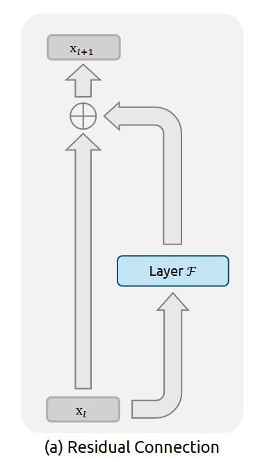
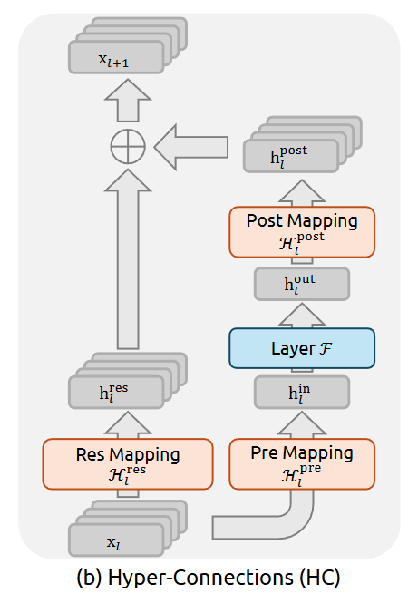
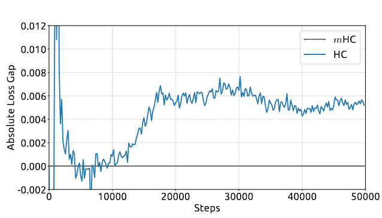
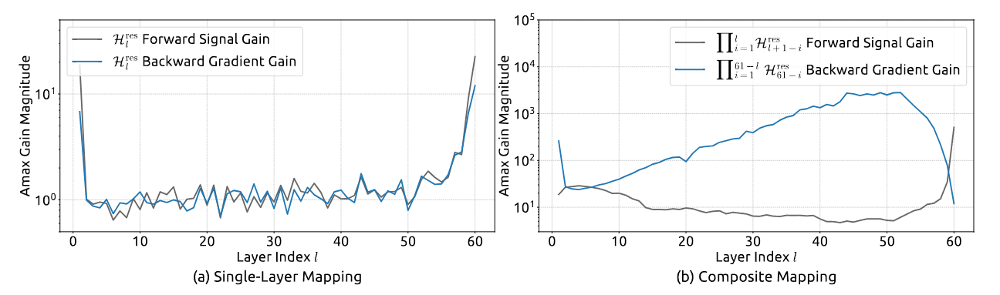
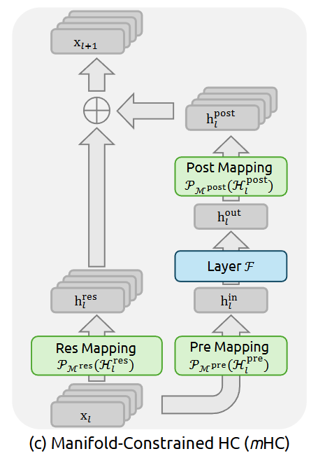
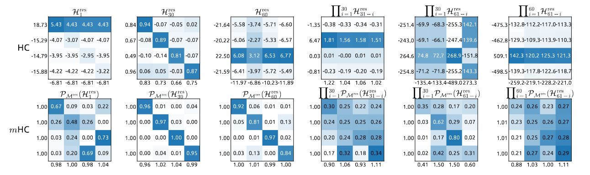
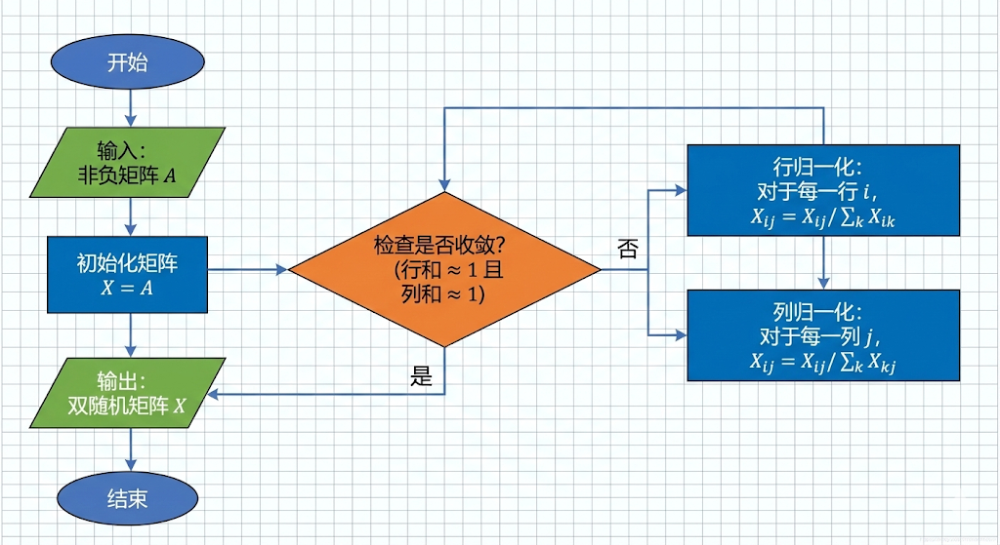
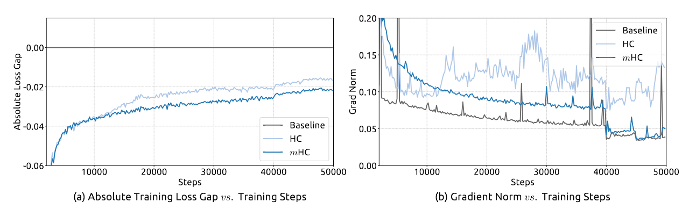
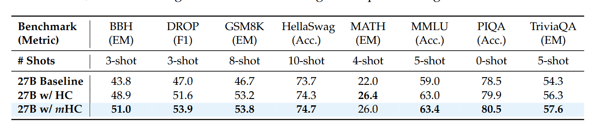
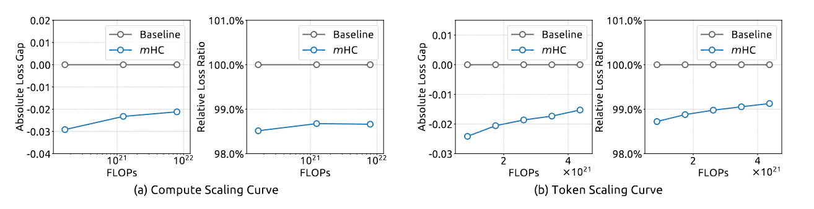

# 1. 从残差连接到HC
讨论 mHC 之前我们要先讨论前人是怎么做的，解决了什么问题，又出现了什么新的问题，这里简单讲下残差链接和 HC ，具体内容可以去看原论文 [Identity Mappings in Deep Residual Networks](https://arxiv.org/abs/1603.05027) 和 [Hyper-Connections](https://arxiv.org/abs/2409.19606)

## 1.1 残差
在一开始提出 DNN 的时候，DNN 的每一层都可以表示为一个函数 $x_{l+1}=f(x_l)$ ，其中 $x_l$ 是这一层的输入， $x_{l+1}$ 是这一层的输出。这样很多个函数叠在一起就可以表示复杂的函数关系。

但是这样在每一层的传递中原始信息的特征就会逐渐衰减，于是提出了残差来解决这个问题（如图）。

我们将上面的公式改为 $x_{l+1}=x_l+f(x_l,\ W_l)$ 其中 $W_l$ 是第 $l$ 层的权重参数。

>这样改有一个好处就是对于较深层 $L$ 和较浅层 $l$ 有：$x_L=x_l+\sum\limits_{i=l}^{L-1}f(x_i, W_i)$ 。
>
>这意味着 $L$ 层的输出是 $l$ 层与他之间的残差和，这是一种恒等映射，他维持了大规模训练的稳定性和效率。
 
用人话讲就是每一层给下一层的输出 $x_{l+1}$ 不止有这一层操作过的 $f(x_l)$ 还包括原始的输入 $x_l$，这样就保证了每一层获得的信息更大，避免信息衰减。

## 1.2 HC
2024年字节提出了 Hyper-Connections ，他将残差通道的宽度扩展 $n$ 倍，将第 $l$ 层的输入 $x_l$ （一个 $d$ 维的向量）变为一个由 $n$ 个不同的 $d$ 维向量拼接而来的矩阵，并引入了可学习矩阵去把他们 mix 在一起。

这样就扩大了残差流的宽度，增强了连接的复杂性。

在 HC 里，残差项不再直接相加，而是乘一个动态调整的矩阵：$x_{l+1}=\mathcal{H}_{l}^{res} x_{l}+\mathcal{H}_{l}^{post \top} \mathcal{F}\left(\mathcal{H}_{l}^{pre } x_{l}, \mathcal{W}_{l}\right)$

这样虽然在小规模实验中效果不错，但是也造成了一个问题：在大规模实验中直接暴毙。

造成这种现象的原因就是无约束残差矩阵的谱范数（也就是一个矩阵对向量产生的“最大拉伸能力”）可能大于 1 ，导致信号在 forward 传播中被持续放大，backward 传播时梯度也随之爆炸（如 HC 的 Amax Gain Magnitude 峰值达 3000），即使单层矩阵谱范数不大，多层乘积的谱范数也可能指数级增长。

# 2. mHC: Manifold-Constrained Hyper-Connections
为了解决这个问题，DeepSeek 提出了 mHC 。

## 2.1 流形（Manifold）
流形 (Manifold) 是一个几何形状，它在局部看起来像是平坦的欧几里得空间，但在整体上可以是非常复杂、弯曲甚至扭曲的。

打个比方：
* 当你站在操场上，或者看一张城市地图时，地面看起来是平的（二维平面）。你可以画直角坐标系，用勾股定理计算距离。对于渺小的人类来说，地球表面在局部就是“平坦”的。
* 如果你飞到太空中，你会发现地球其实是一个球体（封闭曲面）。你不能用一张无限大的平面地图来无损地覆盖整个地球（必须要有拼接或者变形）。

在数学上：一个 $n$ 维流形 是一个拓扑空间，其中每一个点都有一个邻域，这个邻域和 $n$ 维欧几里得空间 ( $R^n$ ) 在拓扑上是等价的（同胚）。

人话来讲就是：
* **1维流形（曲线）：** 比如一根弯曲的绳子或一个圆圈。虽然它整体是弯的，但如果你截取极小的一段，这一段看起来就像是一条直线。
* **2维流形（曲面）：** 比如甜甜圈表面（环面）或皮球表面（球面）。虽然整体形状各异，但任何一小块剪下来，都像是一张平整的纸。

## 2.2 双随机矩阵与 Birkhoff 多面体
了解了流形的概念后，我们可以看下 DeepSeek 是怎么解决 HC 的爆炸问题的。

双随机矩阵可以理解为一个元素非负，每一行元素加起来等于 1 ，每一列元素加起来也为 1。

双随机矩阵的集合被称为 Birkhoff 多面体，mHC 的解决方案就是将 Birkhoff 多面体的相对内部（Birkhoff 多面体本身是凸多面体不是流形，mHC 使用的是 Sinkhorn-Knopp 算法投影后的双随机矩阵，这部分是严格的光滑流形）作为残差映射 $\mathcal{H}_{l}^{res}$ 的约束流形。

人话来讲就是把残差矩阵 $\mathcal{H}_{l}^{res}$ 约束在双随机矩阵所构成的流形上。那为什么这样就能解决问题呢？

第一，双随机矩阵的谱范数是恒小于等于 1 的。这样保证了信号不会被放大，反向传播时，梯度的 “最大压缩 / 放大比” 也被限制为 1 ，避免梯度爆炸或消失。

第二，双随机矩阵有乘法封闭性，也就是两个双随机矩阵相乘还是双随机矩阵。这样就保证了深层模型的 “跨层稳定性”，无论模型深度 $L$ 多大，多层残差映射的乘积始终是双随机矩阵，谱范数仍为 1 ，信号和梯度的稳定性不会随层数加深而退化。

第三，Birkhoff 多面体是置换矩阵的凸包，也就是说多面体的顶点恰好是置换矩阵，内部点是 “软置换”（加权重排）而非 “无约束混合”。这意味着 mHC 的特征混合是 “基于原始特征的平滑重分配”，而非 HC 的 “随机拉伸”，保证信息既不被创造也不被破坏。

## 2.3 Sinkhorn-Knopp 算法
上面我们已经理解了 mHC 的原理，我们想一下怎么让这个残差矩阵落在这个流形上呢？下面我们讲一下 Sinkhorn-Knopp 算法。

用最通俗的话说，它是一个“矩阵整形器”。它的作用是把一个普通的非负矩阵，通过反复的“揉捏”，最终变成一个双随机矩阵，也就是把它扔进我们刚才讨论的 Birkhoff 多面体里。

假设你有一个全是正数的矩阵 $A$ 。你的目标是：让它的每一行加起来都等于 1 ，同时每一列加起来也都等于 1 。Sinkhorn 算法采用了最暴力的“按起葫芦浮起瓢”的策略：
* **第一步（行归一化）：** 先不管列，把每一行的数字除以该行的总和。现在每一行的和都是 1 了！太强了！但是列的和乱套了，肯定不等于 1。
* **第二步（列归一化）：** 现在不管行，把每一列的数字除以该列的总和。现在每一列的和都是 1 了！太爽了！但是刚才调好的行和又被破坏了，不再是 1 了。

但如果你一直不停的重复做这两步(大概20次)，不停的行归一化，列归一化，行归一化，列归一化……神奇的事情发生了：虽然每次都会破坏另一边的平衡，但破坏的程度会越来越小。最终，这个矩阵会收敛到一个完美的双随机矩阵。

而初始的非负矩阵 $A$，我们只需要在一开始把矩阵内的元素 $x_{i,j}$ 变为 $e^{x_{i,j}}$ 即可。

# 3. 实验结果
mHC 缓解了 HC 出现的训练不稳定性。

同时在性能上也带来了提升。

此外还进一步验证了scaling能力。

# 参考
[Identity Mappings in Deep Residual Networks](https://arxiv.org/abs/1603.05027)

[Hyper-Connections](https://arxiv.org/abs/2409.19606)

[mHC: Manifold-Constrained Hyper-Connections](https://arxiv.org/abs/2512.24880)

[如何评价Deepseek于12月31日最新发表的mHC架构论文？](https://www.zhihu.com/question/1990102682397074043/answer/1990779344122040823)

[如何理解 DeepSeek 最新提出的 mHC 架构？](https://www.zhihu.com/question/1990084005744362243/answer/1990204935745335923)

[解读DeepSeek梁文锋最新论文 一个视频看懂！从传统残差连接到字节跳动HC到mHC](https://www.bilibili.com/video/BV19MiFBCEDr)