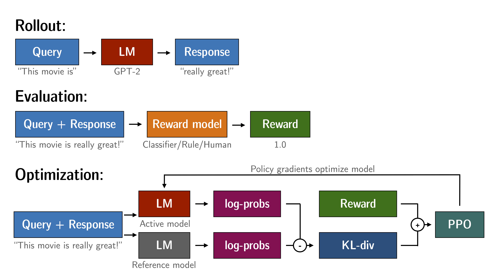

## 1. 流程回顾

本期内容以 trl 为例做一个 PPO 的代码分析。

首先回顾下 PPO 的算法流程：
1. Rollout：根据输入的 prompt 生成 response 形成 prompt-response 对。
2. Evaluation：对 prompt-response 对进行评估，通过奖励模型打分。
3. Optimization：根据 prompt-response 对生成经验数据再优化模型。



代码：
```python
for epoch in tqdm(range(NUM_EPOCH), "epoch: "):
    # 只训练到配置里指定的 PPO epoch 数；NUM_EPOCH 可能只是一个上限
    if epoch >= config.total_ppo_epochs:
        break

    # 每个 batch 里通常包含：
    # - input_ids: prompt 的 token id（用于生成）
    # - query: prompt 的原始文本（用于拼 reward 输入 / 日志）
    for batch in tqdm(ppo_trainer.dataloader):

        # =========================
        # 1) Rollout: 用当前 policy 采样生成回答
        # =========================
        # prompt token ids（问题/指令）
        question_tensors = batch["input_ids"]

        # 基于 prompt 生成 response（只返回生成部分，不包含 prompt）
        response_tensors = ppo_trainer.generate(
            question_tensors,
            return_prompt=False,                 # True 则返回 prompt+response 的整段
            length_sampler=output_length_sampler, # 控制采样生成长度（例如随机长度区间）
            **generation_kwargs                  # generate 的采样参数：top_p/top_k/temperature/max_new_tokens 等
        )

        # 解码生成的 token ids -> 文本字符串，方便后续计算 reward / 记录日志
        batch["response"] = tokenizer.batch_decode(
            response_tensors,
            skip_special_tokens=True
        )

        # =========================
        # 2) Evaluation: 计算每条 (prompt, response) 的标量奖励 reward
        # =========================
        # 将 prompt 和 response 拼成奖励模型/打分器需要的输入格式
        # 这里用的是示例模板：Question... Answer...
        texts = [
            "Question: " + q + "\n\nAnswer: " + r
            for q, r in zip(batch["query"], batch["response"])
        ]

        # 用情感分析 pipeline 当奖励函数：输出越“正面”分数越高（仅示例）
        pipe_outputs = sentiment_pipe(texts, **sent_kwargs)

        # 从 pipeline 输出中取出每条样本的 score，转成 torch.tensor
        # rewards 是一个 list[Tensor]，长度=batch_size，每个元素是标量 reward
        rewards = [torch.tensor(output[0]["score"]) for output in pipe_outputs]

        # =========================
        # 3) Optimization: 用 PPO 做一次更新
        # =========================
        # step() 内部会（高层理解）：
        # - 计算每个 token 的 logprob / value（可能还包含参考模型 ref 的 logprob）
        # - 组合奖励（通常含你给的 rewards + per-token KL penalty，取决于配置/版本）
        # - 用 GAE 算 advantage / returns
        # - 按 PPO clipped objective 更新 policy/value
        # 返回 stats：训练统计信息（loss、kl、entropy、reward 等）
        stats = ppo_trainer.step(question_tensors, response_tensors, rewards)

        # 记录统计量 + 文本 + reward，便于在控制台/W&B/TensorBoard 观察训练过程
        ppo_trainer.log_stats(stats, batch, rewards)
```

前两个部分在代码里很清楚了下面主要看第三个部分。

## 2. Optimization

Optimization 这一步基本都发生在 `ppo_trainer.step(question_tensors, response_tensors, rewards)` 里面。step 内部会把它展开成按 token 对齐的一整套训练信号，然后跑 PPO 的 policy/critic 更新。TRL 官方文档对这一步的高层描述是：用 query/response 计算 token 的 logprob（当前模型 + reference 模型），用 KL 作为额外 reward 信号，最后用这些 reward 去优化模型。

### 2.1 即时奖励计算

计算即时奖励时，reward 模型给出的 score 是句子级别的，所以只能把 reward 的分数放在句子的最后一个 token 上，其余 token 加 KL 惩罚。

先算每 token 的近似 KL：

$$
\mathrm{kl}*t \approx \log \pi*\theta(a_t|s_t) - \log \pi_{\text{ref}}(a_t|s_t)
$$

再得到每个 token 的 non-score reward（也就是 KL 惩罚项）：

$$
 r_t^{\text{KL}} = -\beta \cdot \mathrm{kl}_t
$$

假如 $T$ 是最后一个 token，那么：

$$
t<T：r_t = r_t^{\text{KL}}
$$

$$
t=T：r_T = r_T^{\text{KL}} + r_{\text{score}}
$$

代码：
```python
def compute_rewards(
    self,
    scores: torch.FloatTensor,
    logprobs: torch.FloatTensor,
    ref_logprobs: torch.FloatTensor,
    masks: torch.LongTensor,
):
    """
    目标：把“句子级的 score”(reward model 输出) 变成“token 级 reward 序列”，
    并且在每个 token 上加入 KL 惩罚（约束 policy 不要偏离 reference model）。

    输入张量形状（典型）：
      scores:        (batch_size,)                         # 每条样本一个标量分数（RM / 打分器）
      logprobs:      (batch_size, response_length)         # 当前 policy 对每个生成 token 的 log p(a_t|s_t)
      ref_logprobs:  (batch_size, response_length)         # reference policy 对同一 token 的 log p_ref(a_t|s_t)
      masks:         (batch_size, response_length)         # 1 表示有效 token（非 padding），0 表示 padding

    输出：
      rewards:           (batch_size, response_length)     # 每 token 的总 reward = KL shaping + (最后一位加 score)
      non_score_rewards: (batch_size, response_length)     # 只包含 KL shaping 的 reward（每 token）
      kls:               (batch_size, response_length)     # 每 token 的 KL 估计（或近似项）
    """

    # 用 Python list 临时存每条样本的结果，最后再 stack 成 batch tensor
    rewards, non_score_rewards, kls = [], [], []

    # 逐样本处理（zip 会把 batch 的每一行取出来）
    for score, logprob, ref_logprob, mask in zip(scores, logprobs, ref_logprobs, masks):
        # 1) 计算每个 token 的 KL（近似）：用当前 policy 与 reference policy 在“同一已采样 token”上的 logprob 差
        #    kl 的形状：(response_length,)
        #    注意：这里并不是严格的 KL(分布对分布)，而是常见的“sample-based KL 近似/惩罚项”
        kl = self._kl_penalty(logprob, ref_logprob)
        kls.append(kl)

        # 2) KL 惩罚转成 reward shaping：
        #    non_score_reward = - beta * kl
        #    beta 就是 self.kl_ctl.value（可能是自适应调的 KL 系数）
        #    形状：(response_length,)
        non_score_reward = -self.kl_ctl.value * kl
        non_score_rewards.append(non_score_reward)

        # 3) 初始化本条样本的“总 reward 序列”为 KL shaping reward
        #    先 clone，避免后续对 reward 的修改影响 non_score_reward
        reward = non_score_reward.clone()

        # 4) 找到最后一个“有效 token”的位置（即 padding 之前的最后一个 token）
        #    mask.nonzero() 返回所有非零位置的索引（形状类似 (n, 1) 或 (n,) 取决于 mask 的维度）
        #    [-1] 取最后一个有效位置，也就是 response 的终止 token（通常是 EOS 或最后一个生成 token）
        last_non_masked_index = mask.nonzero()[-1]

        # 5) 把句子级的 score（来自 RM / 打分器）只加到最后一个有效 token 上
        #    这等价于：episode 的终止奖励在最后一步发放，其余步为 0（除了 KL shaping）
        #    所以总 reward = (每 token 的 KL shaping) + (最后一步额外 +score)
        reward[last_non_masked_index] += score

        # 6) 收集本条样本的 token-level reward 序列
        rewards.append(reward)

    # 7) list -> tensor，堆成 batch
    #    输出形状：(batch_size, response_length)
    return torch.stack(rewards), torch.stack(non_score_rewards), torch.stack(kls)kbd
```

## 2.2 优势计算

优势计算这一步做的事情就是把最后一个 token 中的大分按因果关系往前分摊，算出每个 token 贡献了多少，也就是 advantage，再得到从这步开始总共能拿多少，也就是 return。

现在我们手里有两样东西：
1. 上一步中 reward 模型给出的即时奖励，前面的 token 只有一点 KL 惩罚，最后一个 token 在 KL 惩罚的基础上有一个 reward 模型给出的 score。
2. critic 模型给出的每个位置的未来收益预测。

有了这两样东西就能算 TD 残差 $\delta_t$，也就是这一 token 比预期好多少：

$$
\delta_t = r_t + \gamma V_{t+1} - V_t
$$

通俗解释一下就是，我这一步真实看到的未来收益 = 我现在拿到 $r_t$ + 之后还能拿 $V_{t+1}$（当然这里还要乘一个折扣因子），而 critic 模型在上一 token 中预测从现在开始能拿收益 $V_t$。

这个差值就是 critic 模型猜错了多少，如果大于零说明这一步比 critic 预期的更好，如果小于零说明比预期更差。

而最后一个 token 没有下一步了：

$$
V_{T+1}=0
$$

所以：

$$
\delta_T = r_T - V_T
$$

如果最后加了一个很大的 score，$\delta_T$ 往往会很大。

下面 GAE 用了一个从后往前的递推来算 advantage $A_t$：

$$
A_t = \delta_t + \gamma\lambda A_{t+1}
$$

也就是说，第 $t$ 步的贡献（advantage） = 这一步本身的 $\delta_t$ + 后面步骤贡献的一部分（按 $\gamma\lambda$ 打折），其中 $\lambda$ 越大，最后的 score 会影响更早的 token； $\lambda$ 越大：最后的 score 会影响更早的 token。

算出 advantage 后，return 定义为：

$$
R_t = A_t + V_t
$$

也就是说 $V_t$ 是 critic 的原预测，$A_t$ 是修正量，加起来就是更接近真实的从这一步开始的总回报。

代码：
```python
def compute_advantages(
    self,
    values: torch.FloatTensor,
    rewards: torch.FloatTensor,
    mask: torch.FloatTensor,
):
    # lastgaelam：GAE 递推里“后一时刻的 advantage”（A_{t+1}），从最后往前算时用来累积
    lastgaelam = 0
    # 先倒序把每一步算出来的 advantage 存起来（因为我们是从后往前推）
    advantages_reversed = []
    # 生成的 response 长度 T（也就是 token 数）
    gen_len = rewards.shape[-1]

    # 把 padding 的位置清零：mask=0 的 token 不是有效生成 token，不参与 reward/adv 计算
    values = values * mask
    rewards = rewards * mask

    # （可选）把 reward 在有效 token 上做标准化/缩放，让训练更稳定
    # shift_mean=False：通常表示不强制把均值移到 0（细节取决于 masked_whiten 实现）
    if self.config.whiten_rewards:
        rewards = masked_whiten(rewards, mask, shift_mean=False)

    # 从最后一个 token 往前算（因为 A_t 依赖 A_{t+1}）
    for t in reversed(range(gen_len)):
        # nextvalues = V(s_{t+1})
        # 最后一步没有下一步（句子结束），所以 V(s_{T+1}) 设为 0
        nextvalues = values[:, t + 1] if t < gen_len - 1 else 0.0

        # TD 残差（“这一步比 critic 预期好/差多少”）：
        # δ_t = r_t + γ V(s_{t+1}) - V(s_t)
        delta = rewards[:, t] + self.config.gamma * nextvalues - values[:, t]

        # GAE 递推（把“后面步骤的影响”按 γλ 衰减传回当前步）：
        # A_t = δ_t + γλ A_{t+1}
        # lastgaelam 此时保存的是 A_{t+1}
        lastgaelam = delta + self.config.gamma * self.config.lam * lastgaelam

        # 记录当前步的 A_t（倒序记录）
        advantages_reversed.append(lastgaelam)

    # 由于我们倒序 append，这里翻转回正序，再堆成 tensor
    # stack 后形状大致是 (gen_len, batch)，转置成 (batch, gen_len)
    advantages = torch.stack(advantages_reversed[::-1]).transpose(0, 1)

    # Return：给 value head 的监督目标
    # R_t = A_t + V(s_t)
    returns = advantages + values

    # PPO 更新通常会把 advantage 在有效 token 上再做一次标准化（更稳）
    advantages = masked_whiten(advantages, mask)

    # advantage 只作为 policy loss 的“权重/标签”，不参与反向传播（不把梯度传回 value 计算图）
    advantages = advantages.detach()

    # 返回：
    # - values：清零 padding 后的 value（有时用于统计/clip）
    # - advantages：每个 token 的 advantage（用于 policy 更新）
    # - returns：每个 token 的 return（用于训练 value head）
    return values, advantages, returns
```

### 2.3 loss

PPO 中我们训练 policy 和 critic 两个模型，有了上面算出来的东西就可以算他们的 loss 了。

critic 要预测每个 token 位置从这里开始最终能拿多少总回报。刚刚我们已经算了return，而 critic 给出的预测是 $V_{\text{new}}(s_t)$，此时最朴素的回归损失就是均方误差：

$$
L^{V}_t=\frac12\big(V_{\text{new}}(s_t)-R_t\big)^2
$$

也就是预测越接近 return，loss 越小。

然后随之而来的问题是，critic 一次更新如果改得太猛，会让 advantage 计算不稳定，进而带崩 policy。所以 PPO 给 critic 也加了限速器（value clipping），新预测不允许相对旧预测跳太大。

设旧的预测为 $V_{\text{old}}(s_t)$。把新预测 clip 在旧预测附近一个小区间：

$$
V^{clip}_t=\text{clip}\Big(V_{\text{new}}(s_t),\ V_{\text{old}}(s_t)-\epsilon_v,\ V_{\text{old}}(s_t)+\epsilon_v\Big)
$$

然后算是否进行 clip 的两份误差，最终取二者最大值：

$$
L^{Vclip}_t=\frac12\max\Big((V*{\text{new}}-R_t)^2,\ (V^{clip}-R_t)^2\Big)
$$

现在我们来看 policy ，现在有一段已经生成过的回答，这段回答里的每个 token 都是当时旧模型采样出来的，还算出了每个 token 的 advantage $A_t$：它告诉你这个 token 选得好不好。

policy loss 要解决的问题是：怎么让模型以后更倾向生成 advantage 高的 token，同时又别一步把概率改得太夸张。PPO 用的就是 比较新旧概率 + clip 限速。

我们先来定义新旧概率改了多少，对同一个 token $a_t$，就是你当时采样出来的那个 token，旧模型给它的概率是 $\pi_{\text{old}}(a_t|s_t)$，当前正在更新的模型给它的概率是 $\pi_{\text{new}}(a_t|s_t)$。

定义比值 ratio：
$$
\rho_t = \frac{\pi_{\text{new}}(a_t|s_t)}{\pi_{\text{old}}(a_t|s_t)}
$$

举几个例子：
* $\rho_t=1$：你没改这一步的倾向
* $\rho_t=1.2$：你把这个 token 的概率提高了 20%
* $\rho_t=0.8$：你把它降低了 20%

考虑 advantage 的意义我们很容易想到我们最朴素的目标是最大化：

$$
\rho_t A_t
$$

为了用“最小化 loss”的形式写，就加负号：

$$
L^{PG}_t = -\rho_t A_t
$$

让好 token 概率涨，让坏 token 概率跌。

随之而来的问题就是，如果某个 token 的 $A_t$ 很大，模型可能会把 $\rho_t$ 拉得特别大，比如 5 倍、10 倍，训练会不稳定甚至崩掉。

所以 PPO 用 clip 进行了限制，一次最多改 $\pm \epsilon$，把 ratio 截断到区间：

$$
\rho^{clip}_t = \text{clip}(\rho_t,\ 1-\epsilon,\ 1+\epsilon)
$$

然后在原始目标和截断目标之间，选择更保守的那个防止通过大步更新钻空子：

$$
L^{CLIP}_t = -\min\Big(\rho_t A_t,\ \rho^{clip}_t A_t\Big)
$$

代码：
```python
def loss(
    self,
    old_logprobs: torch.FloatTensor,
    values: torch.FloatTensor,
    logits: torch.FloatTensor,
    vpreds: torch.FloatTensor,
    logprobs: torch.FloatTensor,
    mask: torch.LongTensor,
    advantages: torch.FloatTensor,
    returns: torch.FloatTensor,
):
    """
    PPO 的核心 loss：policy loss + value(critic) loss（都带 clip，防止一步更新太猛）。

    关键输入（都按 token 对齐）：
    - old_logprobs: rollout 时“旧策略”对每个生成 token 的 log π_old(a_t|s_t)
    - logprobs:     当前参数下“新策略”对同一批 token 的 log π_new(a_t|s_t)
    - advantages:   每个 token 的 advantage A_t（>0 鼓励该 token，<0 抑制）
    - returns:      每个 token 的 return R_t（用来监督 value head）
    - values:       rollout 时的旧 value 预测 V_old(s_t)（作为 value clip 的锚点）
    - vpreds:       当前 value head 的新预测 V_new(s_t)
    - mask:         有效 token=1，padding=0（只在有效 token 上计算均值）

    输出：
    - loss:         总 loss = policy_loss + vf_coef * value_loss
    """

    # =========================
    # 1) Critic / Value loss（带 value clipping）
    # =========================

    # value clipping：限制新 value 相对旧 value 的改动幅度在 ±cliprange_value 内
    # V_clip = clip(V_new, V_old - ε_v, V_old + ε_v)
    vpredclipped = clip_by_value(
        vpreds,
        values - self.config.cliprange_value,
        values + self.config.cliprange_value,
    )

    # 两种 value 回归误差：
    # 1) 不 clip： (V_new - R)^2
    # 2) clip 后： (V_clip - R)^2
    vf_losses1 = (vpreds - returns) ** 2
    vf_losses2 = (vpredclipped - returns) ** 2

    # PPO 的保守做法：对每个 token 取更大的那个误差（max），防止 value 通过“大跳”投机性降低 loss
    # 再对有效 token 做 masked mean；0.5 只是经典 MSE 的常数因子（让梯度里不多一个 2）
    vf_loss = 0.5 * masked_mean(torch.max(vf_losses1, vf_losses2), mask)

    # 统计：有多少 token 触发了 clipping（即 clip 后的误差反而更大）
    vf_clipfrac = masked_mean(torch.gt(vf_losses2, vf_losses1).float(), mask)

    # =========================
    # 2) Policy loss（PPO clipped objective）
    # =========================

    # ratio = π_new / π_old
    # 用 logprob 差再 exp 得到比值，数值更稳定：
    # ratio = exp(log π_new - log π_old)
    ratio = torch.exp(logprobs - old_logprobs)

    # 未 clip 的 policy loss（我们希望最大化 ratio * A，所以写成最小化 loss 时加负号）
    # L1 = -A_t * ratio
    pg_losses = -advantages * ratio

    # clip 的 policy loss：把 ratio 限制在 [1-ε, 1+ε]
    # L2 = -A_t * clip(ratio, 1-ε, 1+ε)
    pg_losses2 = -advantages * torch.clamp(
        ratio, 1.0 - self.config.cliprange, 1.0 + self.config.cliprange
    )

    # PPO 的保守目标在“最大化 objective”形式是 min(...)；
    # 这里是“最小化 loss”形式（带负号），等价于取 max(pg_losses, pg_losses2)
    # 再对有效 token 做 masked mean
    pg_loss = masked_mean(torch.max(pg_losses, pg_losses2), mask)

    # 统计：有多少 token 在 policy 侧触发了 clipping
    pg_clipfrac = masked_mean(torch.gt(pg_losses2, pg_losses).float(), mask)

    # =========================
    # 3) 总 loss
    # =========================
    # vf_coef 控制 value loss 的权重（避免 critic 太强/太弱）
    loss = pg_loss + self.config.vf_coef * vf_loss
```