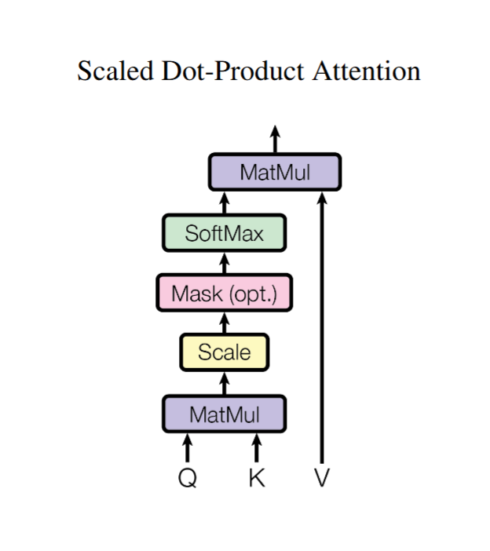
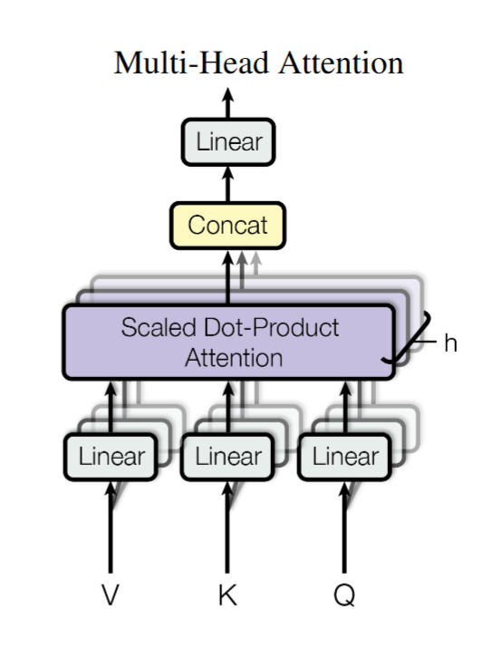

## 1. 缩放点积注意力（Scaled Dot-Product Attention）


个人认为可以理解成用 token 的 query 去查询每一个 token 的 key，相乘得到的矩阵中元素就是两个 token 之间的关联程度，也就是注意力的大小。在后面 softmax 之后作为权重与 value 相乘求和得到最终的输出，token 之间关联性较大的权重就高，最终输出受他 value 的影响就更大。

下一步就是大家经常讨论的为什么要在 $QK^T$ 后除以 $\sqrt d_k$ 。

我们先假设 $Q_i,\ K_i$ 独立，均值为 $0$，方差为 $1$，点积为：$\sum\limits_{i=1}^{d_k} Q_i K_i$，这时均值是0，但方差变成了 $d_k$ （对于独立随机变量之和，方差等于方差之和），这会导致 softmax 变得很 “尖”，比如最大值比次大值大很多的时候最大的那个权重在 softmax 后会接近 $1$ ，而其他的权重接近 $0$，从而导致梯度消失或训练不稳定等问题。于是我们需要除以 $\sqrt d_k$ 进行放缩，把方差降回 $1$ 。

在这之后可选加 mask，也就是把不允许关注的位置忽略。

下一步就是用 softmax 把 $Q$ 和 $K$ 相乘后除以 $\sqrt d_k$ 的每个元素转化为一个介于 $0$ 到 $1$ 之间的实数，且所有元素的和等于 $1$ 。

最后与 $V$ 相乘求和得到最终的 $Output$ 。

$$\mathrm{Attention}(Q, K, V)=\mathrm{softmax}\!\left(\frac{QK^{\top}}{\sqrt{d_k}}\right)V$$

## 2. 自注意力 (Self-Attention)

当 $Q,\ K,\ V$ 由同一坨东西乘以各自的权重矩阵 $w_q,\ w_k,\ w_v$ ，得出时，就是 Self-Attention。

代码实现：

```python
class SelfAttention(nn.Module):
	def __init__(self, input_dim, dim_qk, dim_v):
		super().__init__()
		self.q = nn.Linear(input_dim, dim_qk)
		self.k = nn.Linear(input_dim, dim_qk)
		self.v = nn.Linear(input_dim, dim_v)
		self.scale = sqrt(dim_q_k)
		
	def forward(self, x):
		q = self.q(x)
		k = self.k(x)
		v = self.v(x)
		
		scores = torch.bmm(q, k.transpose(1, 2)) / self.norm
		weights = torch.softmax(scores, dim = -1)
		out = torch.bmm(weights, v)
		
		return out

#--------------------------------------------------

input_dim = 128
dim_qk = 64
dim_v = 64

attn = SelfSelfAttention(input_dim, dim_qk, dim_v)

batch_size=2
seq_len=10

x = torch.randn(batch_size, seq_len, input_dim)

out = attn(x)

print("input_shape: ", x.shape)
print("output_shape: ", out.shape)
print(out)
```

## 3.  多头自注意力机制（Multi-Head Attention, MHA）



多头注意力就是对同样的 $Q,\ K,\ V$ 做多次注意力得到不同的 output，不同的 output 连起来得到最终的 output。多头注意力机制使模型能够联合关注不同位置、不同表示子空间的信息。也就是说不同头的 output 是从不同层面考虑相关性得到的不同输出。

代码实现：

```python
class MultiHeadAttention(nn.Module):
	def __init__(self, input_dim, num_heads, dim_qk, dim_v):
		super().__init__()
		self.num_heads = num_heads
		self.head_dim_qk = dim_qk // num_heads
		self.head_dim_v = dim_v // num_heads
		
		self.q = nn.Linear(input_dim, dim_qk)
		self.k = nn.Linear(input_dim, dim_qk)
		self.v = nn.Linear(input_dim, dim_v)
		
		self.scale = sqrt(self.head_dim_qk)
		
		self.out = nn.Linear(dim_v, input_dim)
		
	def forward(self, x):
		batch, seq = x.shape[:2]
		
		q = self.q(x);
		k = self.k(x);
		v = self.v(x);
		
		q = q.view(batch, seq, self.num_heads, self.head_dim_qk).transpose(1, 2)
		k = k.view(batch, seq, self.num_heads, self.head_dim_qk).transpose(1, 2)
		v = v.view(batch, seq, self.num_heads, self.head_dim_v).transpose(1, 2)
		
		scores = torch.matmul(q, k.transpose(-2, -1)) / self.scale
		weights = torch.softmax(scores, dim = -1)
		
		out = torch.matmul(weights, v)
		out = out.transpose(1, 2).contiguous().view(batch, seq, -1)
		out = self.out(out)
		
		return out
		
#--------------------------------------------------

#保证qkv维度能被头数整除
input_dim = 512
num_heads = 8
dim_qk = 512
dim_v = 512

mha = MultiHeadAttention(input_dim, num_heads, dim_qk, dim_v)

batch_size=2
seq_len=10

x = torch.randn(batch_size, seq_len, input_dim)

out = mha(x)

print("input_shape: ", x.shape)
print("output_shape: ", out.shape)
print(out)
```

## 4. 交叉注意力（Cross Attention）

Cross Attention（交叉注意力）就是“用一段序列去查询另一段序列的内容”。它和 Self-Attention 的区别在于：$Q$ 来自一边，$K/V$ 来自另一边；Self-Attention 则 $Q/K/V$ 都来自同一个输入。

decoder 先把自己当前位置的状态变成一个问题向量Q（Query）。可以理解成：现在要找什么信息。

encoder 把每个源端 token 的表示变成索引向量K（Key）和内容向量V（Value）。K 用来匹配“跟我的问题像不像“， V 像正文内容，真正要抄回来的信息。

代码实现：

```python
class CrossAttention(nn.Module):
	def __init__(self, input_dim, dim_qk, dim_v):
		super().__init__()
		self.q = nn.Linear(input_dim, dim_qk)
		self.k = nn.Linear(input_dim, dim_qk)
		self.v = nn.Linear(input_dim, dim_v)
		
		self.scale = sqrt(dim_qk)
		
	def forward(self, encoder_input, decoder_input):
		q = self.q(decoder_input)
		k = self.k(encoder_input)
		v = self.v(encoder_input)
		
		scores = torch.bmm(q, k.transpose(1, 2)) / self.scale
		weights = torch.softmax(scores, dim = -1)
		out = torch.bmm(weights, v)
		
		return out

#--------------------------------------------------

input_dim = 128
dim_q_k = 64
dim_v = 64

cross_attn = CrossAttention(input_dim, dim_qk, dim_v)

batch_size = 2
src_len = 10
tgt_len = 8

encoder_output = torch.randn(batch_size, src_len, input_dim)
decoder_input = torch.randn(batch_size, tgt_len, input_dim)

out = cross_attn(encoder_output, decoder_input)

print("encoder_output_shape: ", encoder_output.shape)
print("decoder_input_shape: ", decoder_input.shape)
print("output_shape: ", out.shape)
print(out)
```