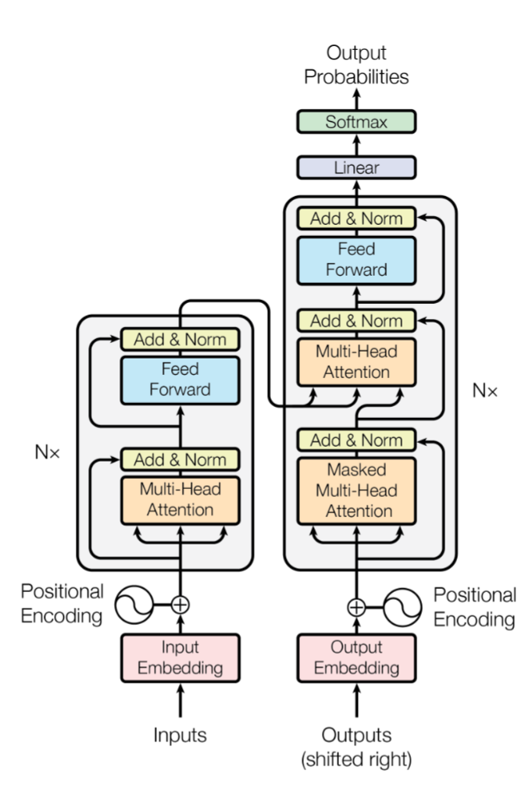

## 1. Encoder-Decoder

在 Transformer 架构中，Encoder 用于理解输入，生成相应的语义特征。Decoder 用于生成输出，使用 Encoder 输出的语义结合其他输入来生成最终结果。

这是原始 Transformer 的核心设计， Encoder包含两个子层：多头自注意力机制和位置前馈神经网络；Decoder：比编码器多一个 Masked Multi-Head Attention，确保模型在预测下一个词时，只能利用之前的信息，通过掩码，将未来的词的注意力权重设为负无穷。（attention 部分详解见往期内容）

他的工作流程可以简单理解为：先把输入整句读懂并存成记忆（encoder），再一边写输出一边去记忆里查相关输入（decoder + cross-attention）。

假设任务是翻译：输入 x = “I love pigs”，输出 y = “我 爱 猪”。

把整句输入一次性喂进去，每个词都能看见左右所有词（双向 self-attention，只挡 pad）。编码完得到一串向量记忆 M = [m1, m2, m3]，分别对应 “I / love / pigs” 的上下文表征。可以把它理解成“这句话的可查询数据库”。

Decoder 这时候的输入只有起始符 \<BOS>。Decoder 内部先做一次 masked self-attention：当前位置只能看自己左边，不能看未来。因为现在只有 \<BOS>，这一步主要是在建立“输出端状态”。

同一层 decoder 里紧接着有一个 cross-attention 层，这个在往期内容里讲过。decoder 用 Q 去和所有 K 算相似度，得到权重 $α1..α3$，再把 V 加权求和，得到一个“从输入里读出来的上下文向量”。这一步的直觉就是：生成“我”时，模型会把注意力更多放到输入里的 “I”。

接下来生成第 2、3… 个 token 时，masked self-attention 让 decoder 能利用“我”这个历史，cross-attention 让 decoder 继续去输入记忆里对齐（可能更关注 “love”）如此循环直到输出结束。

Encoder-Decoder 特别适合翻译/摘要/改写/信息抽取后生成这类“条件生成”任务。因为它直接建模 $p(y|x)$。Encoder 把 x 编成可查询的 memory；Decoder 每一步通过 cross-attention 动态决定“这一步该看输入的哪一部分”，对齐路径清晰、可控性强。

## 2. Encoder-only

比较有代表性的模型是 Bert ，处理输入序列，捕捉序列的全局信息，生成相应的特征向量。

从计算图角度，你可以把 Encoder-only 拆成三块：Embedding（token embedding + position embedding + segment/type embedding 相加）、Encoder 堆叠（每层 Multi-Head Self-Attention + FFN，配残差/LayerNorm）、以及任务头（分类/序列标注/QA 等）。

Encoder-only 不需要 causal mask ，一般只用 padding mask 避免 attend 到 pad；因此每个位置得到的是“全局双向条件下的表征”，更适合 NLU（分类、匹配、检索、抽取）。

预训练目标主要是 MLM + NSP。MLM 是随机遮住一部分 token，让模型在双向上下文里预测被遮住的 token；NSP 是判断句子 B 是否是句子 A 的下一句，用来让模型更好建模句间关系。

它的局限也很明确：不擅长开放式生成。原因不是不能输出 token，而是训练目标与推理形态不匹配：MLM 训练时只遮少量位置，而生成要求连续预测一长串位置；直接把大量位置都 MASK 会造成分布偏移，效果通常不好且代价高。

## 3. Decoder-only

只使用解码器部分，如 GPT，通过自回归机制，根据之前的词预测下一个。

推理时把 prompt 喂进去，模型输出下一个 token 的概率分布，采样/贪心选一个 token，拼回序列，再喂回去，如此循环。为了避免每一步都重复算历史 token 的注意力。

为什么现在多数用 Decoder-only？

Decoder-only 能够同时处理理解和生成任务，并且模型结构简单，训练部署优化难度小，对资源要求低。