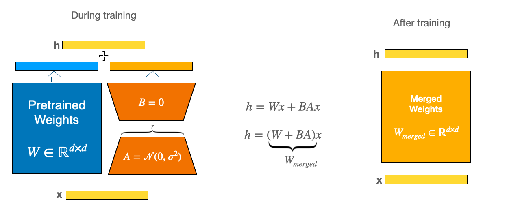
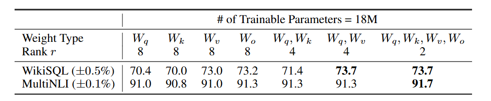
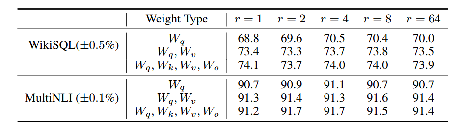

## 1. SFT

SFT（Supervised Fine-Tuning，监督微调）是把一个预训练大模型（通常是基座模型）用带标准答案的监督数据再训练一轮，让它在特定任务/特定风格/特定工具使用上更像你想要的样子。它本质上是继续做下一词预测，但训练样本从通用语料换成了“指令-回应”“多轮对话”“工具调用轨迹”等更贴近应用的数据。

## 2. LoRA

LoRA（Low-Rank Adaptation）是一种参数高效微调方法，把大模型原始权重全部冻结，只在少数线性层里“外挂”一组可训练的低秩增量，从而用很少的可训练参数完成任务/领域适配。LoRA 最常插在注意力和/或 MLP 的线性投影层上（如 Q/V 投影、输出投影、MLP 的 up/down projection）

## 3. LoRA原理

在模型中大量运算都是与模型权重做矩阵乘法，可以看作：

$$
h=Wx
$$

全量微调会让 $W$ 变成 $W'$ ，也就是让原本的模型权重学一个更新量 $\Delta W$：

$$
W'=W+\Delta W
$$

LoRA 原论文提出假设，在从预训练模型适配到下游任务时，权重变化 $ΔW$ 具有较低的内在秩，因此可以用两个小矩阵的乘积来参数化更新，而不必学习一个满秩的大矩阵。所以 LoRA 让模型不直接学一个 $ΔW$ ，而是先把它拆成两个小的矩阵：

$$
ΔW=BA
$$

其中 $A\in \mathbb{R}^{r\times d_{\text{in}}}$，$B\in \mathbb{R}^{d_{\text{out}}\times r}$，并且 $r$ 很小（比如 8/16/32）。这样 $\Delta W$ 的秩最多是 $r$。原始 $W$ 冻结不动，只训练 $A,B$。

在训练或推理时输出变为：

$$
h=(W+BA)x
$$

这种方式除了参数量小以外还有另一个好处是：可以在更换下游任务时更换 AB 矩阵，换成适配该下游任务的新的 AB 矩阵，实现热插拔。

为控制 LoRA 的有效幅度，让他在不同的 rank $r$ 下更稳定，我们需要乘上一个缩放系数：

$$
s=\frac{\alpha}{r}
$$

常见 $\alpha=2r$。

## 4. BA矩阵的初始化

用随机初始化 $A$ 并把 $B$ 置零。

如果一开始 $BA\neq 0$ ，等价于你在训练开始前先给权重加了一坨随机噪声，可能直接破坏预训练的分布与输出。

但如果一开始 $A$ 和 $B$ 都初始化为 $0$ 的话，因为 $ΔW=BA$ ，导致 $A$ 和 $B$ 的梯度都为 $0$，无法进行训练。

那为什么用随机初始化 $A$ 并把 $B$ 置零，而不是用随机初始化 $B$ 并把 $A$ 置零呢？

设输入为 $x$，则

$$
\Delta y = BAx
$$

对两矩阵的梯度大致是：

$$
\frac{\partial \mathcal{L}}{\partial B} \propto (\frac{\partial \mathcal{L}}{\partial \Delta y}) (Ax)^\top\\\ \\
\frac{\partial \mathcal{L}}{\partial A} \propto B^\top (\frac{\partial \mathcal{L}}{\partial \Delta y}) x^\top)
$$

如果初始化成 $A=0$ 、 $B$ 随机：虽然仍有 $\Delta W=0$，但这时 $Ax=0$，所以 $\partial \mathcal{L}/\partial B = 0$，$B$ 在一开始根本拿不到梯度，等于先卡住，只能先靠 $A$ 从 $0$ 学到非 $0$，$B$ 才开始真正学习，早期优化会更慢、更不稳。

而用 $A$ 随机、$B=0$：$Ax$ 通常非零，所以 $\partial \mathcal{L}/\partial B$ 立刻非零，$B$ 第一轮就能更新；虽然 $\partial \mathcal{L}/\partial A$ 起步为 $0$（因为 $B=0$），但 $B$ 一旦更新成非零，$A$ 也会随即得到梯度并开始学习。

## 5. $r$ 的选择与 LoRA 插入位置

通过原论文可以看到，应该尽可能的在更多参数矩阵应用LoRA，即使 $r$ 很小，而不是弄一个大的r在一个参数矩阵上。