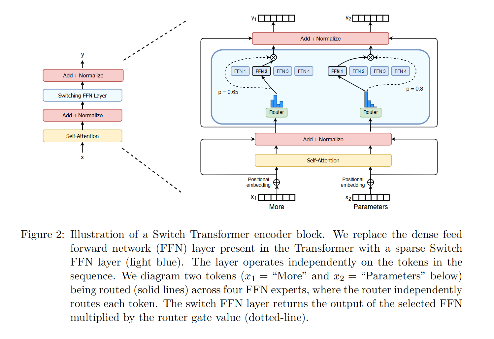

## 1. 为什么需要 MoE

把模型做大，参数做多能提高模型的能力，但稠密模型的计算和显存成本会几乎按参数量线性上涨，训练/推理很快就不可承受。MoE 做的事就是试图把更大的参数容量和可控的每 token 计算量进行解耦。

MoE 能够在远少于稠密模型所需的计算资源下进行有效的预训练。这意味着在相同算力下可以扩大模型和数据集规模。

## 2. MoE 原理

MoE 的原理是把原来的稠密层变成很多个并行的专家子网络，但每个 token 只激活其中少数几个，用条件计算在不让每 token 计算量线性爆炸的前提下，把总参数容量做大。

MoE 层由两部分组成：稀疏 MoE 层，门控网络或路由。

* **稀疏 MoE 层：** 通常是 $N$ 个结构相同的 FFN/MLP，也就是把 Transformer block 里的 FFN 复制 $N$ 份。每个 expert 都是一个完整的小前馈网络。
* **门控网络或路由：** 一个很小的网络对每个 token 的隐向量 $x$ 输出一个长度为 $N$ 的打分/概率，用来决定该 token 应该送去哪些 experts。

传统的前馈神经网络所有参数在每次前向传播时都会被激活。所有部分都会参与运算，没有遗漏。而每个专家在训练时学会了不同的知识，推理时只激活部分，调用那些与当前任务最相关的专家即可。

## 3. 工作流程

每一层输出变成了：

$$
y=\sum_{i=1}^{n} G(x)_i , E_i(x)
$$

其中 $E_i(\cdot)$ 是第 $i$ 个 expert，$G(x)$ 是 gate/router 给出的权重向量。 

Router / Gating network 可以把它当成分流器：对每个 token 决定送去哪些 expert(s)，并给出合并时的权重。它本身参数很小，通常就是一层线性层，但它控制了 MoE 的稀疏激活路径。

对于输入 $x$， Router 先给每个 expert 打分。

$$
s = W_r x
$$

这里 $n$ 是 expert 数量，$s_i$ 表示把这个 token 交给第 $i$ 个 expert 的倾向。在 Shazeer 2017 的经典稀疏 MoE 里，还会在 logits 上加噪声，让路由更探索、更容易负载均衡：

$$
H(x)_i = (xW_g)_i + \epsilon \cdot \mathrm{softplus}((xW{\text{noise}})_i),\quad \epsilon \sim \mathcal{N}(0,1)
$$

打分之后我们对分数做一次 Top-k ，选分数最高的 $k$ 个 experts，其余experts 权重全变成 $0$ 。

$$
G(x)=\mathrm{softmax}(\mathrm{KeepTopK}(H(x),k))\\\mathrm{KeepTopK}(v,k)_i =\begin{cases}v_i, & v_i \in \{\text{top-}k \text{ entries of } v\}\\-\infty, & \text{otherwise}\end{cases}
$$

接下来就把 token 发货到被选中的 expert。实现上会把同一个 expert 负责的 token 收集成一批，然后送入各自的 FFN expert 计算。

算完之后把每个 token 从它去过的 expert 那里拿回输出，按 router 给的权重做加权求和，得到该 token 在这一层的最终输出 $y$，再送去下一层：

$$
y=\sum_{i=1}^{n} G(x)_i , E_i(x)
$$

## 4. Router / Gating network 的训练机制

Router的训练与整个MoE模型一起进行，训练时使用组合损失函数：

$$
L_{\text{total}} = L_{\text{task}} + \lambda \cdot L_{\text{load}}
$$

其中 $L_{task}$ 是主任务的损失，$L_{load}$ 是负载均衡损失。 

$$
L_{\text{load}} = \mathrm{KL}\Big(\bar g || \tfrac{1}{K}\mathbf{1}\Big)
$$

其中：
* $K$：expert 的数量。
* $g^{(i)}$：第 $i$ 个 token经过 router 后得到的门控权重向量。它通常是 softmax 后的概率分布。
* $\bar g = \frac{1}{N}\sum_{i=1}^N g^{(i)}$：在一个 batch（或一段 tokens）上，把门控向量做平均，得到这个 batch 的平均路由分布。
* $\frac{1}{K}\mathbf{1} = \Big[\frac{1}{K},\frac{1}{K},\ldots,\frac{1}{K}\Big]$：均匀分布，意思是理想情况下每个 expert 平均被分到 $1/K$ 的概率/流量。

KL 散度是 $\mathrm{KL}(p|q)$ 的性质：当 $p=q$ 时为 $0$，当 $p$ 偏离 $q$ 越多就越大。
所以这项损失就是在逼 $\bar g$ 尽量接近均匀分布：不要让某几个 expert 的平均概率特别大，其他 expert 几乎是 $0$。

如果没有 $L_{\text{load}}$，Router 很容易走向强者恒强，也就是训练早期某几个 expert 偶然表现好一点，主任务梯度就会鼓励 Router 更常把 token 发给它们，导致它们越来越强、越来越忙；其他 expert 因为分不到数据，学不起来，最终整个 MoE 退化成只有少数 expert 在工作。这会带来吞吐/并行效率问题，甚至训练不稳定。