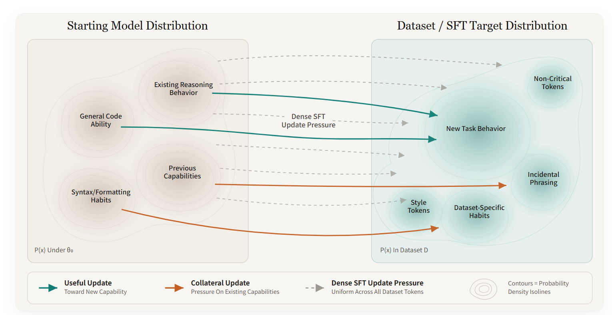
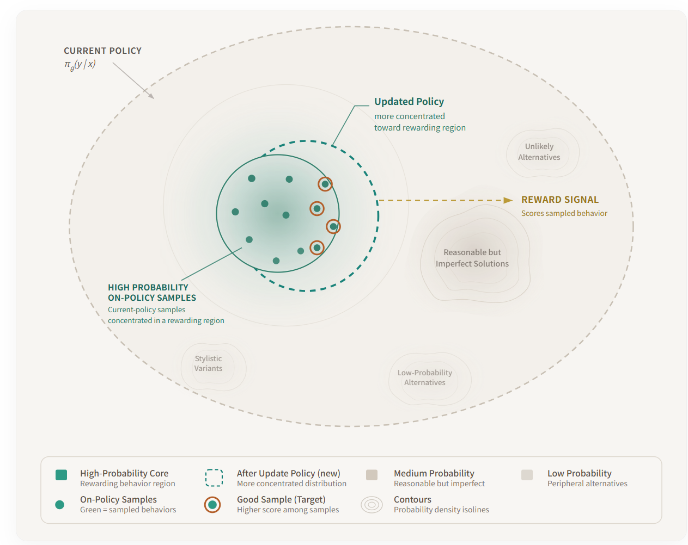
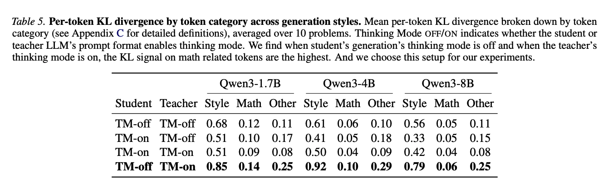
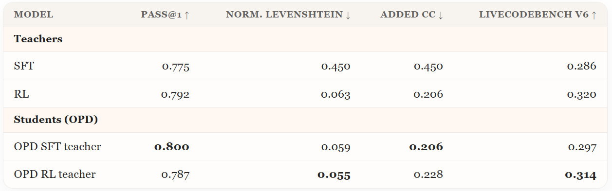
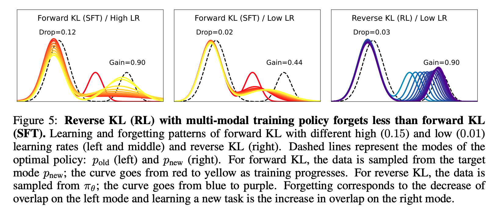
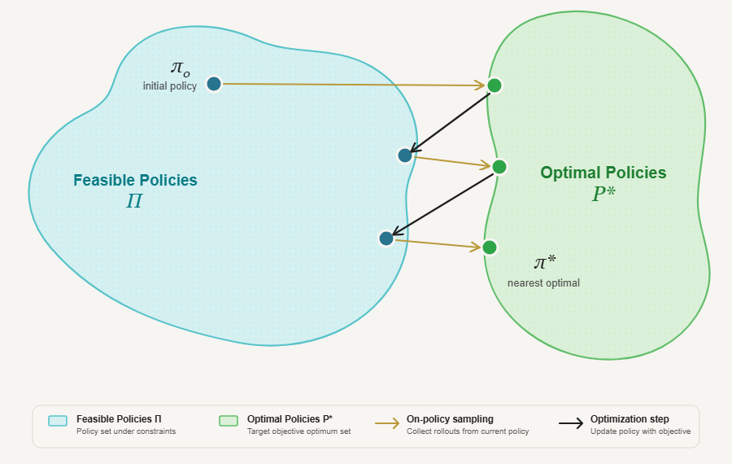
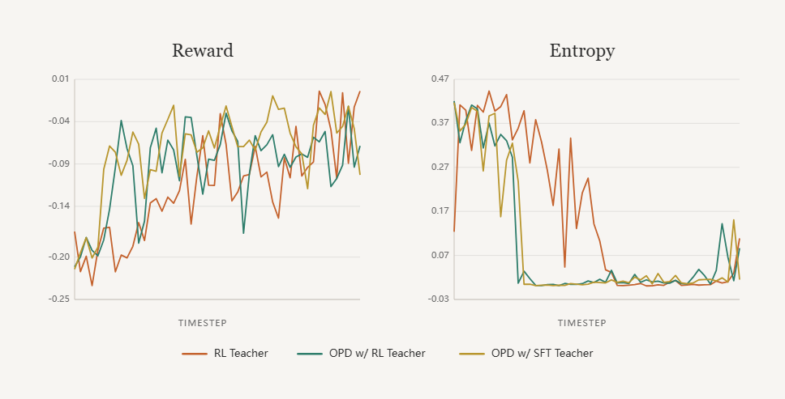
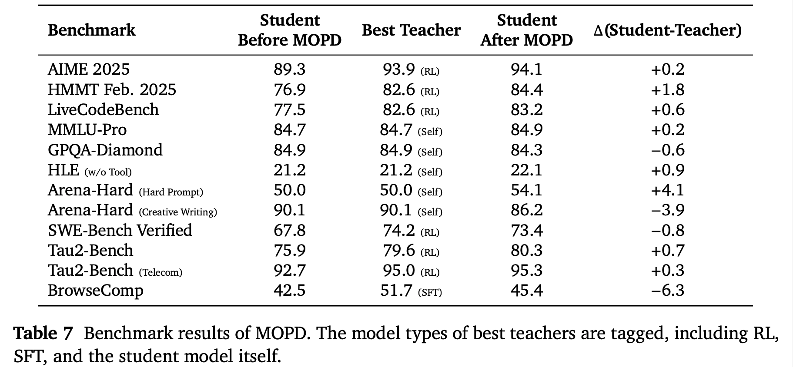

> 文章转载自 https://nrehiew.github.io/blog/sft_rl_opd/
> 
> 为了方便阅读加入了一些主包自己的理解，有 bug 的话欢迎大家提 issue。

语言模型本质上是序列上的一个概率分布。当我们对它进行后训练、试图教会它一个任务时，我们实际上是在重塑这个分布。不同的后训练方法，区别就在于：它们如何重塑这个分布、把什么当作目标、以及这个目标定义得有多直接。

# 后训练的分布视角

在这个视角下，最重要的问题是：**我们正在优化的目标分布是什么**？

## SFT：一个固定的外部目标分布

你有一个标注好的数据集。它可能是人工编写的，也可能是由更强的模型生成的。无论哪种，数据集在训练开始之前就已经存在了。然后你在初始模型上做交叉熵训练。用分布的语言来说：当前模型是一个分布，数据集定义了另一个分布，SFT 把模型拉向数据集分布。

SFT 的训练目标是对数据集中的每条序列最小化：

$$\mathcal{L} = -\sum_t \log p_\theta(y_t \mid y_{<t})$$

这在数学上等价于最小化模型分布与数据分布之间的正向 KL 散度。损失函数里完全没有出现模型原来的分布，没有任何一项在惩罚你偏离起点。

由于负对数似然的本质特性，你的起始分布其实并不重要。这就是为什么 SFT 有一个非常自然的失败模式——灾难性遗忘。如果数据集分布离模型原本的分布很远，模型没有任何内在机制去偏好一个"离原点更近的解"，它只会被径直拉向被演示的那些 token。

这并不是说 SFT 不好。SFT 极其有用。从几何角度看，它是对一个外部目标的直接牵拉，几乎不考虑 starting policy。这使得它非常适合"冷启动"类任务，即预期输出格式需要被大幅改变的场景。

SFT 在整个模型分布上均匀地施加梯度压力，而不仅仅作用在与新任务相关的区域。箭头从起始分布的峰顶（高概率的已有能力）、谷底以及所有其他区域发出。蓝绿色箭头表示把模型推向目标行为的更新；橙色箭头表示可能侵蚀先前能力的附带压力。灾难性遗忘的根源在于：交叉熵损失没有任何内建机制来区分"任务关键 token"和"数据集中偶然出现的伪影"。

## RL：期望奖励最大的方向

在线强化学习看起来很不一样。模型从自身生成分布中采样；这些样本由某个奖励函数打分；然后模型通过策略梯度更新，以最大化它获得的期望奖励。

在这里，目标分布这个概念变得很难定义。我们会在后面的章节再展开讨论，但高层次地说：不存在一个任意的、外部的分布把模型往里拉。

RL 只通过从当前策略中采样到的行为来施加梯度压力。绿点代表 on-policy 的 rollout，橙圈点代表奖励更高、主导更新的样本。虚线轮廓显示概率质量移向受奖励轨迹后的更新策略。与 SFT 不同，SFT 在外部数据集上施加逐 token 的压力，RL 主要重塑模型本来就会访问的高概率区域。这种局部性解释了为什么 RL 能提升任务表现，而不会像 SFT 那样对无关能力施加广泛的压力。

当然，这一切成立的前提是奖励是有意义的。在 RLVR中，奖励是可验证的，奖励方向通常是"模型质量"的一个相当好的 proxy，因此沿着奖励方向移动，理应能得到一个更好的模型。而在 RLHF 中，奖励模型本身是不完美的，情况就要混乱得多了。我们稍后再回到这个话题。

## OPD：伪RL

On-policy distillation（OPD）介于 SFT 和 RL 之间。像 SFT 一样，它有教师信号——学生模型被训练去匹配另一个分布；但像 RL 一样，数据来自学生自己。在每一步，算法执行的是 on-policy 采样，但梯度把学生模型拉向与教师分布匹配的方向——通过反向 KL 散度（reverse KL）。粗略地说，OPD 在本质上可以看作一种类似 RL 的过程：只不过 RL 是用 advantage（优势值）对 completion 加权，而 OPD 是用学生与教师之间的 log 概率比来加权。

OPD 的一个新变体是 On-Policy Self Distillation（OPSD）。教师和学生是同一个模型，但在计算教师的 log 概率时，教师会拿到参考解作为前缀。其核心思想是：教师所能访问的这种特权信息将提供学习信号。

这样做的问题在于，既然教师和学生是同一个模型，那么在大多数 token 上，两者的输出会非常相似。论文作者做了逐 token 的 KL 分析，发现风格型或转折型 token，比如 "wait" 或 "alright"——的 KL 值可能高于数学 token，比如 "power"、"exponent"、"logarithm"。因此，如果我们在这些不重要的 token 上过于激进地更新，模型可能会崩溃。解决办法就是引入一种逐 token 的裁剪机制，防止过度更新。

在所有思考模式配置下，风格 token 的逐 token KL 都显著最高，而数学 token 的 KL 最低。

这就是为什么 OPSD 给人的感觉更接近 RLHF，而不是 RLVR。在 RLHF 中，奖励模型的信号偏差较高，所以我们要用 KL 惩罚和 trust-region 式的裁剪，来避免把错误的东西过度优化。在 OPSD 中，教师信号与任务重要性之间同样不是完美相关的——因为某些高 KL 的 token 可能只是风格词。而 RLVR 的奖励函数偏差较低。这就是为什么人们在 RLVR 中往往更放心地去掉显式的 KL 惩罚、或放松信任域约束。

一个常见的论点是：使用结果奖励的 RLVR 在逐 token 的信用分配上很吃力，advantage 每个 episode 只提供 O(1) 比特的信息。而 OPSD 似乎位于另一个极端：每个 token 都得到自己专属的"奖励"，但算法在每次更新中引入了更多的噪声和偏差。

# 用不同的教师做 OPD

这个实验使用了原作者设计的 Minimal Code Editing 任务：模型会拿到一个被注入了 bug 的函数，要求它只修复 bug，其他什么都不许动。我们会检查两件事：模型的修改是否让代码能正常工作；以及函数的其他部分是否被改动了。

这个环境它能同时检验两件事：

1. **泛化能力：** 我可以在一组损坏类型上训练模型，然后在另一组不同的损坏类型上评估。这可以回答：模型学到的是"最小化编辑"这一通用行为，还是仅仅学会了逆转特定的几种损坏？
2. **灾难性遗忘：** 与标准代码生成任务不同，最小化编辑是一种小众的代码行为。因此我可以在 LiveCodeBench 上评估微调后的模型，检查其通用代码生成能力是否退化。

在这个实验中，原作者先用 SFT 和 RL 分别训练了两个教师模型。两者都学会了最小化编辑行为，但 RL 教师泛化更好、且没有出现明显的遗忘；而 SFT 教师在通用代码生成上出现了退化。

在进行 OPD 之前，原作者预期从 RL 教师蒸馏出的学生会表现得更好。但事实并非如此。

用 SFT 教师训出的 OPD 学生和用 RL 教师训出的 OPD 学生，最终表现惊人地相似。更令人意外的是：两个 OPD 学生都略微超过了 RL 教师，并大幅超过了 SFT 教师，尽管 RL 教师在自己训练结束时拿到过更高的奖励。

此外，尽管 SFT 教师在通用代码生成上出现了退化、而 RL 教师没有，但两个教师训出的 OPD 学生都只表现出轻微的遗忘。OPD 学生的遗忘程度比 SFT 教师还要轻，即使教师本身就是那个已经退化的 SFT 模型。这真的非常出乎意料：因为如果"教师分布"是主导因素，那么从 SFT 教师蒸馏出的学生理应继承更多 SFT 教师的遗忘。但它并没有。

这说明：数据的来源（即 on-policy 采样）影响很大，而教师的影响可能比我预期的小。这是一个充满希望的结果，因为这意味着我们可以 overtrain 一个专用模型，甚至用蛮力 SFT 也在所不惜，然后再通过 OPD 把这个能力学过来，同时完好地保留我们在意的其他能力。

# 为什么 RL 遗忘得更少？

有几个常见的解释，原作者认为有道理但是不太妥。

## SFT 是正向 KL，RL 是反向 KL

第一个解释与两种算法优化的 KL 散度方向有关。SFT 在固定数据集上做交叉熵训练，等价于最小化正向 KL 散度：

$$
\begin{align*}
    D_{KL}(p \| q_\theta) &= \sum_x p(x)\log\frac{p(x)}{q_\theta(x)}\\ &= \sum_x p(x)\log p(x) - \sum_x p(x)\log q_\theta(x)\\ &= -H(p) + H(p, q_\theta)
\end{align*}
$$

正向 KL 的 mode-covering（覆盖众数）行为，可能因此导致模型为了学新任务而牺牲旧的众数（即已有能力）。[Chen et al., 2025 ](https://arxiv.org/abs/2510.18874)则表明 RL 可以看作是在做反向 KL 最小化。

原作者觉得这类论证有用，但并不完整。问题在于：这个论证严重依赖于"对参考模型施加显式 KL 正则"这一假设。但实证上，即使把 KL 惩罚项移除或大幅削弱，RL 仍然表现出抗遗忘的特性。在 RLVR 中，人们训练时使用的 KL 约束往往比 RLHF 式设定弱得多，然而抗遗忘的行为依然普遍存在。

## SFT 的逐 token 梯度是均匀的、激进的

### 数据依赖的正则化

首先，SFT 对每一个 token 都施加稠密而均匀的监督。在 SFT 中，每一个被演示的 token 都被视为模型应当提高其概率的对象。这个 token 可能是任务关键的，比如一个数学运算符；也可能只是一个风格 token，比如 "therefore" 或 "we can see that"。损失函数不知道两者的区别，它只是抬高被演示 token 的概率，从而产生广泛而粗放的更新。[Diao 等人发现](https://arxiv.org/abs/2601.02151)，SFT 数据中包含大量低概率、低熵的 token：这意味着模型对自己的预测原本高度自信，却被强迫去拟合一个与它分歧很大的真值标签，这会冲击已有的表征。

相比之下，RL 具有某种形式的数据依赖正则化（[Lai et al., 2025](https://arxiv.org/abs/2507.05386)）。例如在 advantage estimation 阶段，当奖励在组内做归一化时，多样性和奖励方差较高的组，得到的更新幅度反而更小；而方差较低的组更新更大。这意味着：当模型不确定时，更新幅度会自然而然地减小；反过来，对于那些模型能稳定产出高奖励回答的样本，更新则更加激进。

### RL 的参数更新更稀疏

由此，[Mukherjee 等人发现](https://arxiv.org/abs/2505.11711)：RL 只通过稀疏但满秩的更新修改模型的一个小型子网络，而 SFT 诱导的是稠密更新。类似地，[Yuan 等人](https://arxiv.org/abs/2510.04454)发现 SFT 的参数更新中存在更多冗余。他们对 SFT 和 RL 更新过的参数做剪枝实验，发现 RL 的性能随剪枝下降得快得多，这证实了：SFT 的更新更冗余，而 RL 的更新对最终任务性能更为关键。

就 SFT 与 RL 的对比而言，这两部分论证在实证上都是扎实的。但作者怀疑：它们是否足够通用、能被用于算法层面的分析？还是说这些结果只适用于论文作者们测试过的特定领域？此外，OPD 又该如何放进这幅图景中呢？

## 作者的观点：On-Policy Data

作者最认同的解释来自 [Shenfeld 等人](https://arxiv.org/abs/2509.04259) 的工作。建议感兴趣的读者去读原论文，但其直觉用最简单版本的 RL 就能看清楚。假设我们用 REINFORCE，奖励是 0/1 二值的：奖励为 1 时，这条样本贡献正的训练信号；奖励为 0 时，不贡献任何信号。这种情况下，奖励起到的是一个"过滤器"的作用，整个流程看起来和拒绝采样非常相似。

回到最初"目标分布"的概念，现在 RL 也有一个了。我们可以把最优策略定义为：在该策略下，所有 completion 的奖励都是 1 的策略。当然，最优策略有很多个；但由于我们是在当前策略生成的 on-policy 样本上训练的，（我们实际逼近的）这个最优分布，是所有最优策略中离当前策略最近的那一个。当我们执行一步策略梯度更新时，我们是在把当前策略拟合到这个新的最优策略上，而它隐式地与当前策略保持低 KL。因此：RL 学到的是"离自己最近的能解题的策略"。

因此，RL 学到的是离自己最近的那个能解题的策略。

这为思考"遗忘"提供了一种全新的几何视角：on-policy 数据在每一个时间步上，都把训练过程约束在一个贴近起始策略的分布附近；相比之下，SFT 的目标分布可以任意远。

这就是为什么我认为 OPD 继承了 RL 的抗遗忘特性，也解释了为什么从 SFT 教师蒸馏出的 OPD 学生，遗忘可以比 SFT 教师本人还少，教师是在外部数据上训练的，而学生是在自己的数据上训练的。尽管信号由教师提供，但状态分布仍然是学生的。

这也回答了为什么 on-policy distillation 可能对遗忘更鲁棒。诚然，on-policy distillation 的信号可能方差更高，因为教师的 logits 分布并不完美；但由于其 on-policy 的本质，隐式 KL 正则已经内建于整个设定之中。

On-policy 训练隐式地选择了离当前模型最近的那个可解任务的策略。 采样自当前策略，把更新约束在模型本来就会访问的区域，而不是把模型拉向一个任意的外部目标。因此，在最优策略集合 $P^∗$ 中，训练过程倾向于移向最近的可达最优解 $π^∗$ ，这解释了为什么 on-policy 方法既能提升任务表现，又能保留原始策略的更多部分。

## 为什么学生能超过教师？

这是实验中另一个令人意外的部分，但并非新现象。事实上，在 [Agarwal 等人](https://arxiv.org/pdf/2306.13649)的原始工作中，他们就展示了蒸馏出的学生在 GSM8K 上超过了教师。作者没有一个确凿的解释，但我认为有几个合理的假说。

与传统蒸馏不同，OPD 的监督可能更有针对性，因为它作用在学生自己生成的状态上。这一点很重要，因为学生犯的错误未必是教师会犯的错误。如果我们只在教师生成的轨迹上训练，学生可能会在它很少访问的分布区域上收到监督。而在 OPD 中，教师是在学生自己的前缀上给出建议。

第二，KL 匹配不等于奖励最大化。 在本文开头，我曾把 OPD 描述为"带有逐 token 教师监督的 RL 的某种类比"，但这个类比并不完美。最小化 KL 所产生的训练信号，其偏差显著高于标准 RLVR 的奖励。教师分布中包含着关于风格、不确定性、备选后续和推理结构的信息。去匹配它，可能会以"改善学生采样行为"的方式重塑学生分布，而不是精确复刻教师的贪心输出。

因此，即使教师自己采样出的输出并不更好，学生也能得到提升。如果只从单个 token 的层面思考，这很难理解；但如果从分布塑造的层面思考，就顺理成章了。

目前能给出的最好解释是：模型正在新能力周围经历模式坍缩。观察 OPD 和 RL 训练过程中的熵统计量可以发现，OPD 的熵坍缩要剧烈得多。这在反向 KL 训练的 mode-seeking 特性下是意料之中的，模式坍缩可能导致多样性下降。这部分属于推测，但作者认为分布视角是思考这类问题的正确起点。

OPD 与 RL 的奖励和熵训练曲线。RL 的奖励渐进式上升；而 OPD 的奖励上升要突然得多，并且对应着一次剧烈的熵坍缩。

# 为什么 RL 和 OPD 泛化得更好？

解释这一问题的大部分论据，前文的分析已经给出了。首先，在 SFT 中，模型会因为没有给某个特定答案分配概率而受到惩罚。而 RL 在构造上就不那么像"模仿"——因为监督挂在任务是否成功上，而不是挂在某个特定的 token 序列上。

至关重要的是，我们可以借用 [Ross 等人](https://arxiv.org/abs/1011.0686)的工作。在 SFT 中，模型只见过教师访问过的状态。而在测试时，由于自回归的特性，学生只要犯一个错误，就可能把自己带到教师从未访问过的状态。当学生的前缀偏离了教师会走的路时，这种错配会导致误差不断累积。因此，on-policy 的数据聚合可以减少这种错配。

# 完整 pipeline

大多数开源模型采用 Pretrain → SFT → RL → OPD 的流程。预训练之后的 SFT 是不可或缺的，既为了格式遵循，也为了灌输基础的指令遵循能力，没有它就无法高效地进行 RL（[Chu et al., 2025](https://arxiv.org/abs/2501.17161)）。但在这之后会发生什么？

最近，[GLM-5](https://arxiv.org/abs/2602.15763) 和 [DeepSeek-V4](https://huggingface.co/deepseek-ai/DeepSeek-V4-Pro/blob/main/DeepSeek_V4.pdf) 都使用 OPD 来把各个专家能力合并进最终模型——最终 checkpoint 本身并不再经过 RL。这就引出了一个问题：我们应该如何训练这些专家模型？ 一个可用于跨方法比较的有用参照是 [MiMo-V2-Flash 技术报告](https://arxiv.org/abs/2601.02780)。

数学和代码任务往往更适合 RL。 我们知道 RLVR 在这些领域行之有效。创意写作和一些知识密集型的基准测试，似乎更多受益于自蒸馏或蒸馏式方法。这同样说得通，因为在这些领域，奖励要嘈杂得多，如果我们依赖 LLM judge，那优化的就是一个有偏差的质量代理。

上表还比较了最终合并模型与各位教师的性能。学生真正比教师差的领域，仅限于教师本身是自蒸馏出来的领域，外加 SFT 域的 BrowseComp。而在 RL 域，最终合并模型几乎总能以不同程度的幅度超过教师。为什么会这样，目前尚无定论——但鉴于各类后训练 pipeline 正在向以某种形式的专家合并作为最终阶段收敛，我认为这个现象仍然值得指出。

---

本文的灵感来自 [Brown, 2026](https://x.com/willccbb/status/2050038277454143918)，那篇文章把每种后训练方法刻画为：在与先验的 KL 距离这一约束的不同权衡下，最大化能力。文章的结尾暗示：可能存在某种比 RL 更具计算最优性的算法，同时仍能保持能力 vs KL 位移的帕累托前沿。

而作者希望通过本文说服的是：任何这样的算法，都必须建立在 on-policy 数据之上。RL 并不是什么独一无二的神奇算法，显式 KL 惩罚也不是真正挑大梁的部分。让你既能推高能力、又不烧穿 KL 预算的，是 on-policy 训练本身。这个洞见并不新（[Lu et al., 2025](https://thinkingmachines.ai/blog/on-policy-distillation/#on-policy-learning-as-a-tool-for-continual-learning)），但还没发现有哪篇文章把这些研究串成了一条线——而且大部分文献仍然笼统地把 RL 当作"全面更优"。

On-Policy Distillation 的日益流行，其实让这一点更容易看清了。把 OPD 与 RL、SFT 摆在一起，正是 OPD 和 RL 最终落在相似位置这一事实，确信 on-policy 数据才是那个承重部件。另一个，也是我认为这个假想中的算法必须做对的是古老的信用分配问题。结果奖励太稀疏，这就是 RL 如此昂贵的原因；[Lightman 等人](https://arxiv.org/abs/2305.20050)那种风格的过程奖励模型在大规模下训练效率不佳；而来自教师的 logits 蒸馏虽然给了每个 token 更稠密的信号，却以偏差为代价，进而把你逼进各种麻烦的 clip 方案里。

所以，问题的形状已经比解法更清楚了：你想要的是某种兼有蒸馏的稠密度、RL 的无偏性、以及两者共有的 on-policy 性质的东西。