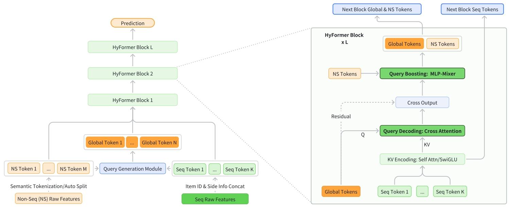
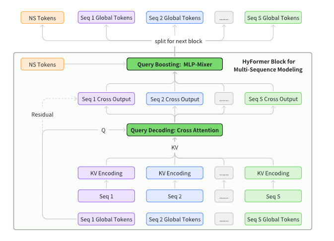

## 0. Abstract

在工业推荐里，既要看用户很长很长的行为历史，又要结合很多不是序列的特征，比如用户年龄、设备、时间、上下文、候选商品属性等，但线上系统又要求算得快、延迟低。论文的核心主张是：不要把“长序列建模”和“特征交互”拆成两段分别做，而是放进一个统一骨干网络里一起做。论文把这套统一框架叫 HyFormer。

现有很多方法是先用 LONGER 这类基于 query token 的序列压缩器把长序列压缩掉，再用 RankMixer 这类 token-mixing 模块去和其他稠密特征做融合。

HyFormer 的做法是把长序列建模和特征交互统一进一个 hybrid transformer 主干里。它有两个反复交替执行的核心模块：Query Decoding 和 Query Boosting。前者把非序列特征扩展成 Global Tokens，再去从长行为序列的分层表示里解码信息；后者通过高效 token mixing 强化不同 query 之间、不同序列之间的异构交互。两者在多层中反复迭代，逐步优化表示。

简单来讲你可以把 Query Decoding 做的事理解成不是先把长序列单独压成固定向量，而是让由非序列特征形成的查询去长序列里找信息。而 Query Boosting 则是把这些探针之间、探针和别的特征之间再做一轮高效交互，让它们更聪明，再继续去下一层检索和更新。

## 1. Introduction

要想预测得准，不能只看用户最近几次点击，而是要同时看很长的用户历史行为，以及很多其他特征，比如用户画像、上下文信号、交叉特征。随着用户行为历史越来越长、特征空间越来越大，怎么把 长序列信息 和 高维非序列信息 有效结合起来，成了推荐和搜索系统里的核心问题。

为了解决这个问题，最近很多工业架构用一种分开做的思路：一部分模块专门处理长行为序列，另一部分模块专门处理特征交互。

具体做法通常是：先用一个序列 Transformer 把用户长行为序列编码压缩，得到少量序列 token；然后再把这些压缩后的序列 token 和其他异构特征放到 token-mixing 或交互模块里，做跨特征推理。这种 先做长序列建模，再做异构特征交互 的流水线已经很有效，也成了工业大模型推荐系统里很主流的设计。

虽然这种范式效果不错，它本质上有三个特点：

1. compressed\
假设用户有 5000 条历史行为。老范式会先用专门的序列模型把这 5000 条压成 1 个或少量几个 token，再拿这几个 token 去和别的特征做交互。这样做当然省计算，但代价是很多细节在压缩时已经丢了。后面即使再和候选物品、上下文做交互，也只能基于 已经压缩好的摘要 来做，没法回到原始长序列里重新精细挑重点。
1. late-fusion\
就是 融合发生得太晚。也就是说，模型先自己把序列理解完，再拿结果去和别的信息融合。问题在于，序列该怎么理解，本来就应该受当前候选物品、场景、用户属性影响。比如同一个用户，面对 手机壳 候选时应该重点关注数码历史，面对 跑鞋 候选时应该重点关注运动历史。如果你在融合前就把序列表示基本定型了，那这个序列表示就不够 面向当前候选。
1. unidirectional interaction\
就是信息流方向几乎只有一条：长序列 → 压缩表示 → 和其他特征交互。其他特征没法反过来影响 怎么读长序列。

现有模型在压缩用户长行为序列时，通常会用一些 query token 去 从长历史里提取重点 。但这些 query token 往往只来自一小部分候选相关特征，或者少量全局特征，所以它们携带的上下文信息其实很有限。于是模型在理解 用户长期兴趣 时，能参考的信息不够丰富。一个看上去直接的改进是多放几个 query token，让它们带更多信息、从不同角度去读长序列。但这么做会显著伤害线上效率，因为 query token 数量一多，在 KV-Cache / M-Falcon 这类加速机制下，计算和存储成本都会上去。

并且原方法的 scaling efficiency 较低。你把模型做大，当然有可能更强，但你的架构是先单独建模长序列，再在后面拿压缩结果和别的特征做一点融合，那么你把参数加上去，很多提升可能只发生在 序列分支自己更会压序列 或者 后面的交互模块自己更复杂 上，而不是让 序列信息和异构特征之间的联合理解 真正同步变强。

前面那些问题说明，我们不能再用 先把长序列单独编码好，再去做特征交互 的老思路了。我们要做更深的交互，更早的交互，双向的交互。

所以作者提出了一个叫 HyFormer 的混合 Transformer 架构，它把 长序列建模 和 特征交互 统一放进同一个主干网络里。HyFormer 设计了一组 global tokens，作为长行为序列和异构特征之间共享的语义接口。整个模型通过堆叠结构，反复交替执行两个模块：

* Query Decoding：让 global query tokens 去关注长行为序列在各层产生的 key-value 表示，从长序列里读出和当前全局上下文相关的信息。
* Query Boosting：再通过高效的 token mixing，让这些 query 之间、不同序列之间发生更强的交互，使语义表示在层与层之间逐渐变丰富。

这样，信息就不再是 先序列、后融合 的单向流动，而是在序列建模和特征交互之间双向来回流动。

具体流程就是：

1. 先有一组 global tokens，里面装着非序列特征的全局语义，用它们去长历史里读信息（Query Decoding）
2. 读完之后，再让这些 token 彼此交互、增强表达（Query Boosting）
3. 然后带着更强的 query 去下一层继续读历史，层层重复

本文的贡献为：

1. 指出老范式的问题
2. 提出 HyFormer
3. 效果很好

## 2. Related Work

### 2.1 Traditional Recommendation Paradigms

介绍了一下传统方法

### 2.2 Unified Recommendation Architectures

介绍了一下几个尝试做新路线统一建模的工作，比如：HSTU、InterFormer、MTGR、OneTrans。

但是 MTGR 和 OneTrans 这类方法，做统一建模时有点太直接了，它们基本上是把所有非序列特征都变成 query tokens。这样 token 数量一下就上来了，线上服务效率会明显下降。

## 3. Methodology

### 3.1 Problem Statement

设 $\mathcal U$ 和 $\mathcal I$ 分别表示用户集合和商品集合。
对于某个用户 $u \in \mathcal U$，把他的原始行为历史记作 $S=[i^{(u)}_1,\dots,i^{(u)}_t]$，其中每个 $i^{(u)}_k \in \mathcal I$，也就是历史里的每一次行为都对应一个商品。
再用 $v$ 表示和这个用户一起出现的非序列特征，比如用户画像、上下文信号、交叉特征。
给定一个候选商品 $i \in \mathcal I$，目标是估计用户 $u$ 与商品 $i$ 发生交互的概率：

$$
P(y=1\mid S,u,v)\in[0,1]
$$

其中 $y\in{0,1}$ 表示这次交互是否真的发生。

人话讲就是：

* 用户：长崎素世
* 历史 $S$：看过 mygo 周边、买过 soyo 立牌、搜过 mygo 棉花娃娃
* 非序列特征：现在是晚上，用的是 iPhone
* 候选商品 $v$：mygo 漫画雨中祈晴

模型要做的事就是：

$$
P(\text{会点} = 1 \mid \text{这些信息})
$$

模型参数是从历史数据集

$$
\mathcal D=\{(S,u,v,y)\}
$$

里学出来的，也就是训练时，每条样本都有用户历史 $S$、用户/上下文等非序列特征 $u$、当前候选商品 $v$、以及标签 $y$。

训练目标是最小化标准的二元交叉熵损失：

$$
\mathcal L=-\frac{1}{|\mathcal D|}\sum_{(S,u,v,y)\in\mathcal D}\big[y\log \hat y+(1-y)\log(1-\hat y)\big]
$$

其中

$$
\hat y=f_\theta(S,u,v)
$$

表示模型输出的预测交互概率。

### 3.2 Overall Framework

hyformer 做了一个很有 transformer 韵味的架构。

首先用一个轻量 MLP 做 Query Generation Module，把 NS Token（非序列特征）和 Seq Token （序列相关信息）捏成 Global Tokens 输入进 Hyformer Block ，然后在 Block 里把他作为 Q 拿去和 Seq Token 的 K/V 做交叉注意力，从长历史里读信息。这个过程就是 Query Decoding ，输出 Cross Output 。

第二步就是把 Cross Output 和输入进来的 NS Token 用一个 MLP-Mixer 风格的模块做 token mixing，输出新的 Global Tokens 作为强化后的 Q 输入给下一层 Hyformer Block。这个过程就是 Query Boosting 。

### 3.3 Query Generation

#### 3.3.1 Input Tokenization

两种方案：

第一种是 semantic grouping 。按语义分组切 token。比如用户特征放一组、上下文一组、行为相关特征一组。这样每个 token 都有比较明确的含义。

第二种是 auto-split 。暴力拼接，平均分割，简单粗暴。

显然要选 semantic grouping 。

#### 3.3.2 Query Generation

先把所有非序列特征 $F_1,\dots,F_M$ 和一个序列全局摘要 $\mathrm{MeanPool}(\mathrm{Seq})$ 拼起来，得到一份总信息：

$$
\mathrm{GlobalInfo}=\mathrm{Concat}(F_1,\dots,F_M,\mathrm{MeanPool}(\mathrm{Seq}))
$$

然后用 $N$ 个小的 FFN 把同一个 $\mathrm{GlobalInfo}$ 投影成 $N$ 个 query token：

$$
Q=[\mathrm{FFN}_1(\mathrm{GlobalInfo}),\dots,\mathrm{FFN}_N(\mathrm{GlobalInfo})]\in\mathbb{R}^{N\times D}
$$

第一层的 query 用 MLP 从 $\mathrm{GlobalInfo}$ 里生成，后面的层里直接用上一层强化后的 query。

### 3.4 Query Decoding

#### 3.4.1 Sequence Representation Encoding

长行为序列先怎么处理，才能拿给后面的 Query Decoding 用？论文给了三种方案：

1. **Full Transformer Encoding：** 直接用标准 Transformer 编码整条历史，表达能力最强，最能抓长距离依赖，缺点是贵。
$$
H_l=\mathrm{TransformerEnc}_l(S)
$$
2. **LONGER-style Efficient Encoding：** 不用完整 self-attention，而是用一个短序列 $S_{\text{short}}$ 去和完整历史 $S$ 做 cross-attention，效果差点但是省算力。
$$
H_l=\mathrm{CrossAttn}(S_{\text{short}},S,S)
$$
3. **Decoder-style Lightweight Encoding：** 丢掉 attention 用前馈变换做序列表示，省钱且快，不过上下文建模能力弱。
$$
H_l=\mathrm{SwiGLU}_l(S)
$$

然后把结果投影成这一层的 K/V：

$$
K_l=H_lW_l^K,\qquad V_l=H_lW_l^V
$$

#### 3.4.2 Query Decoding via Cross-Attention

$$
\tilde Q_{(l)}=\mathrm{CrossAttn}(Q_{(l)},K_{(l)},V_{(l)})
$$

其中：

* $Q_{(l)}$：第 $l$ 层的 query tokens。
* $K_{(l)},V_{(l)}$：第 $l$ 层从长序列算出来的 key/value。
* $\tilde Q_{(l)}$：query 去读完长序列后，得到的“更新版 query。

### 3.5 Query Boosting

先把 $\tilde Q_{(l)}$ 跟非序列特征 $F_1,\dots,F_M$ 拼起来：

$$
Q=[\tilde Q_{(l)},F_1,\dots,F_M]\in\mathbb R^{T\times D},\quad T=N+M
$$

然后把每个 token 的 embedding 切成 $T$ 份小块：

$$
q_t=[q_t^{(1)}|q_t^{(2)}|\dots|q_t^{(T)}],\quad q_t^{(h)}\in\mathbb R^{D/T}
$$

再把不同 token 在相同块中的那段拿出来再拼到一起，让他们在同一个子空间里交换信息：

$$
\tilde q_h=\mathrm{Concat}(q_1^{(h)},q_2^{(h)},\dots,q_T^{(h)})\in\mathbb R^D
$$

接下来把各个子空间混完的信息收集回来：

$$
\hat Q=[\tilde q_1,\tilde q_2,\dots,\tilde q_T]\in\mathbb R^{T\times D}
$$

对每个 token 单独过一个小的 FFN ：

$$
\bar Q=\mathrm{PerToken-FFN}(\hat Q)
$$

最后残差连接一下得到 boosted queries ：

$$
Q_{\text{boost}}=Q+\bar Q
$$

这样下一层再去查长历史时，query 会更强、更有上下文感。

### 3.6 HyFormer Module

总结一下，一层 HyFormer block 就是先 Query Decoding，再 Query Boosting ，然后再层次堆叠。

第 $l$ 层先拿上一层传下来的 query $Q^{(l-1)}$，去读这一层长序列产生的 $K^{(l)},V^{(l)}$ ：

$$
\hat Q^{(l)}=\mathrm{CrossAttn}(Q^{(l-1)},K^{(l)},V^{(l)})
$$

把刚查完历史的 query，和非序列 token 拼起来，送进 Query Boosting，再做一轮轻量 mixing：

$$
\bar Q^{(l)}=\mathrm{QueryBoost}(\mathrm{Concat}(\hat Q^{(l)},\mathrm{NS\ Tokens}))
$$

最上面一层 HyFormer 的输出，不是直接当最终分数，它还会送到后面的 MLP 预测头里，产出最终 CTR 分数。

可以回顾一下刚才的架构图：

### 3.7 Multi-Sequence Modeling

用户行为往往不只有一条序列，而是多条不同语义的序列。 比如短视频场景里可能有观看序列、点赞序列、搜索序列、电商购买序列。Hyformer 的做法是，不把这些序列粗暴拼成一条大序列，而是在每个 HyFormer block 里分别处理，再在 query 层面做交互。

### 3.8 Training and Deployment Optimization

#### 3.8.1 GPU Pooling for Long-Sequence

论文说，用户长序列特征特别大，训练时会带来两个麻烦，一个是主机到 GPU 的数据拷贝开销很大，第二个是主机内存压力也很大。

但同一类商品 ID、品牌 ID、类目 ID 会反复出现，真正 unique 的 feature ID 只占大约 25%。利用这个稀疏性，先把重复特征去重，存成一个压缩 embedding table；等真正执行时，再在 GPU 上把原始序列“还原”出来。反向传播时，再把序列上的梯度聚合回这张压缩表。这样能明显减少传输量和 host 侧内存占用。

#### 3.8.2 Asynchronous AllReduce

GPU 可能得停下来等通信，造成空转。论文这里的做法是把第 $k$ 步的梯度同步，和第 $k+1$ 步的前向/反向计算重叠起来，从而减少通信 bubble、提高 GPU 利用率。

## 4. Experiments

HyFormer 的实验结论很直接，在 $30$ 亿样本、$70$ 天日志、Douyin Search 的真实 CTR 任务上，它离线 AUC 优于传统两阶段模型和现有统一块模型，而且不是靠更高 FLOPs 硬堆出来的。消融实验说明，global query 的全局上下文、Query Boosting、以及“多序列分开建模、在 query 层融合”这三点都是真正有用的。更重要的是，随着参数、FLOPs 和序列侧信息维度增加，HyFormer 的收益增长更快，说明它的 scaling 更好。最后在线上 A/B 里，它还带来了观看时长、完播数提升和 query change rate 下降，证明这套结构不只是离线漂亮，确实能在真实工业系统里跑出收益。

## 5. Conclusions

HyFormer 做的不是发明一个全新 Transformer，而是把“先看历史、后做交互”的老流水线，改成“用更强的 query 反复查历史、反复增强自身”的双向闭环，因此效果更强，也更能扩展。