# Description
DC-1 is a purposely built vulnerable lab for the purpose of gaining experience in the world of penetration testing.
It was designed to be a challenge for beginners, but just how easy it is will depend on your skills and knowledge, and your ability to learn.
To successfully complete this challenge, you will require Linux skills, familiarity with the Linux command line and experience with basic penetration testing tools, such as the tools that can be found on Kali Linux, or Parrot Security OS.
There are multiple ways of gaining root, however, I have included some flags which contain clues for beginners.
There are five flags in total, but the ultimate goal is to find and read the flag in root's home directory. You don't even need to be root to do this, however, you will require root privileges.
Depending on your skill level, you may be able to skip finding most of these flags and go straight for root.
Beginners may encounter challenges that they have never come across previously, but a Google search should be all that is required to obtain the information required to complete this challenge.
Download:https://link.zhihu.com/?target=https%3A//download.vulnhub.com/dc/DC-1.zip

# 1. 信息收集
## 1.1 收集靶机IP地址
由于本次攻击机与靶机在统一网络下，使用 `arp-scan -l` 进行扫描

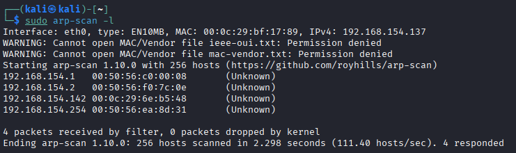

发现靶机 ip 为 `192.168.154.142`

## 1.2 扫描靶机端口
使用 nmap 扫描器，输入命令：`nmap 192.168.154.142`

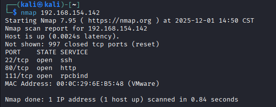

可见靶机暴露了提供 http 服务的 80 端口，尝试用浏览器访问 `192.168.154.142:80`

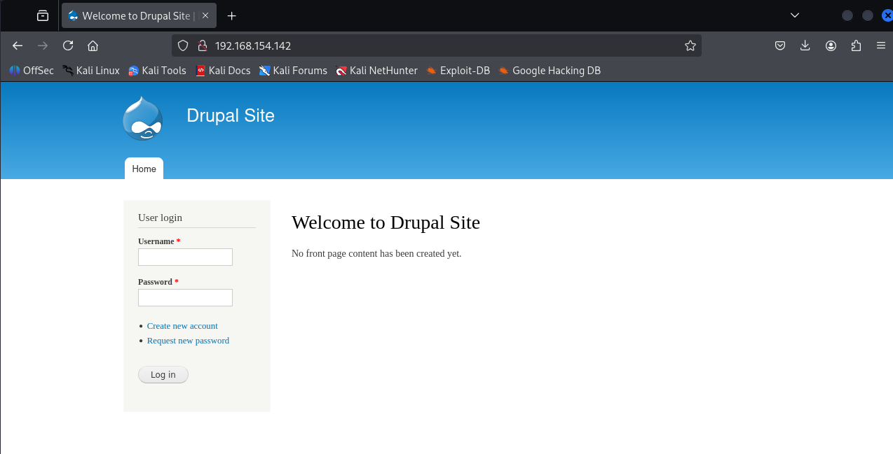

上面为网站的登录图，尝试用 kali 攻击机对靶机进行相关的漏洞攻击进行文件系统窃取

# 2. 漏洞分析
## 2.1 msf
输入 `msfconsole` 

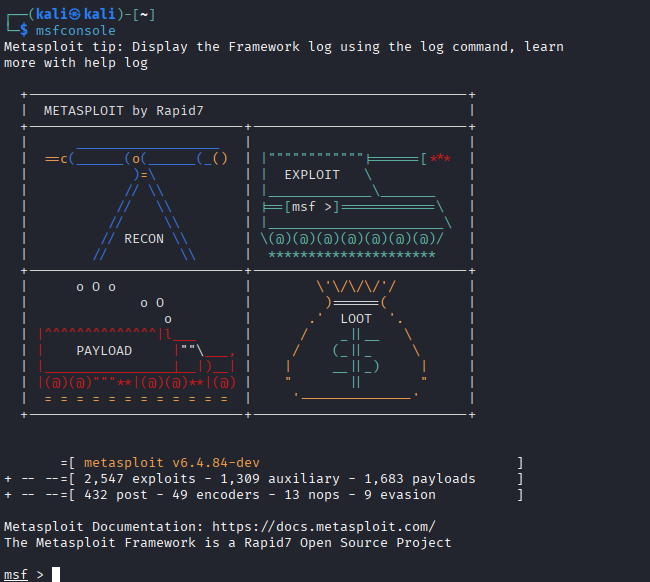

## 2.2 漏洞检索

根据网页上的提示，输入 `search drupal` 检索 drupal 相关漏洞

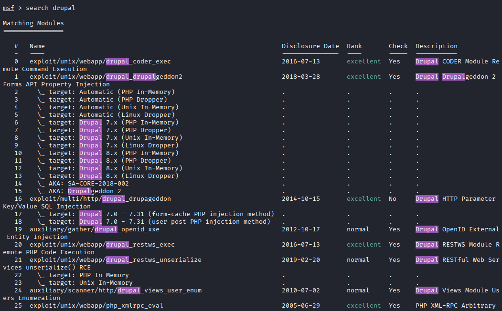

## 2.3 准备攻击

选择 `exploit/unix/webapp/drupal_drupalgeddon2` 来利用这个api漏洞，输入命令 `use exploit/unix/webapp/drupal_drupalgeddon2`

然后输入命令 `show options` 查看需要设置那些攻击选项

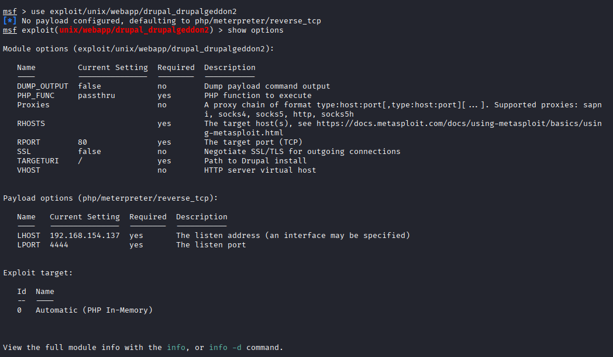

发现需要设置目标IP，输入 `set rhosts 192.168.154.142`

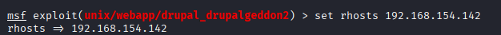

# 3. 漏洞利用与夺旗

## 3.1 利用漏洞进行攻击
接下来，我们便可以使用 `exploit` 或 `run` 命令进行攻击了

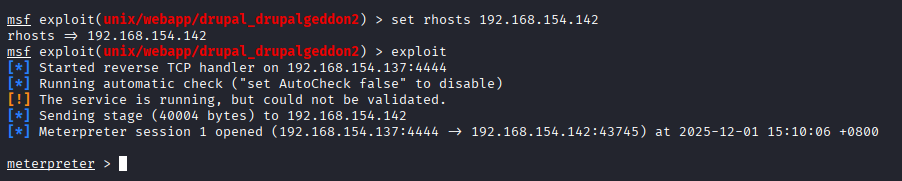

可以发现成功获取 Meterpreter 会话，建⽴反弹 Shell，这表明我们成功入侵了该靶机

`ls` 查看靶机文件

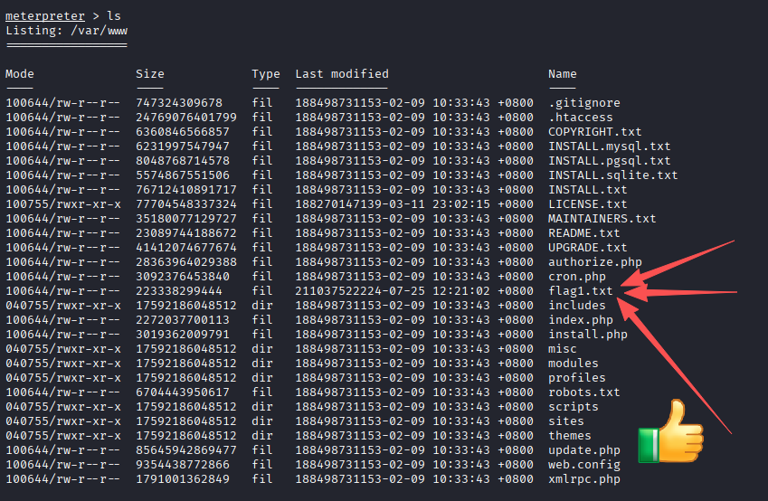

此时得到第一个 flag，让我们看看他里面写的什么

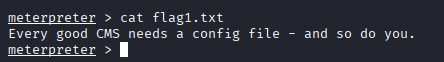

提示我们需要查找 CMS 的相关配置文件

## 3.2 查找配置文件

进入 `/sites/default` 找到配置文件 `settings.php` ，至此我们找到了第二个 flag 和 mysql 数据库的账号密码

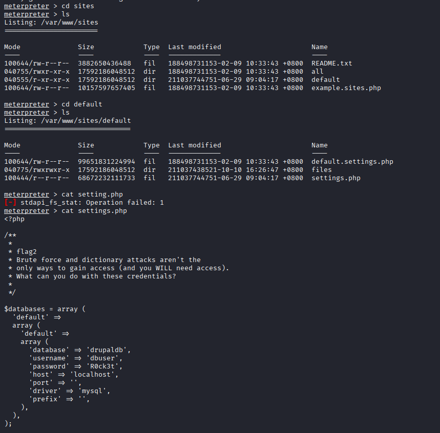

## 3.3 链接数据库

打开 shell，使用下列语句开启交互模式

`python -c "import pty;pty.spawn('/bin/bash')`

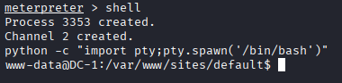

登录数据库

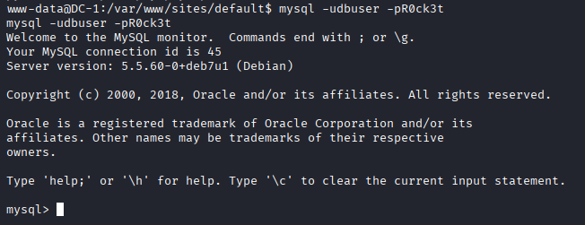

## 3.4 利用数据库

查看数据库信息

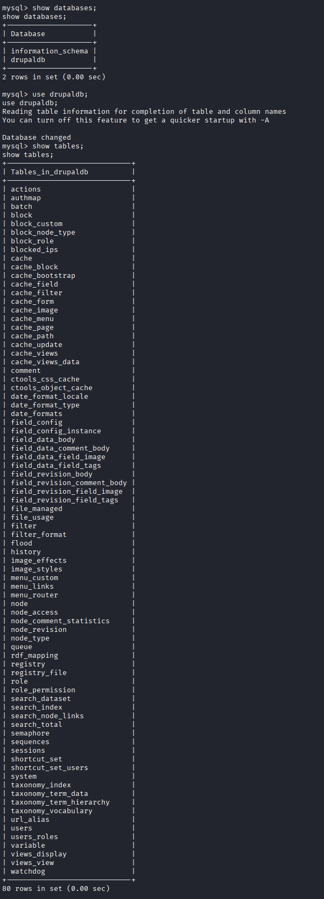

可以看到有 users 表，故可以查看用户信息

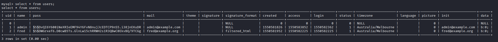

可以看出 users 表中有用户名和密码，但是该密码被加密了。不过密码是密文，并且该加密方式还是 Drupal 自己定义的。需要找到加密脚本随便加密一个已知密码，把 admin 的密码进行更改。

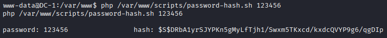

然后登录数据库更改密码

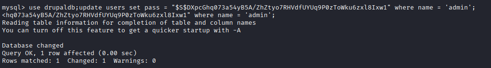

现在可以登录了，用 admin 登录后在 dashboard 里找到 flag3

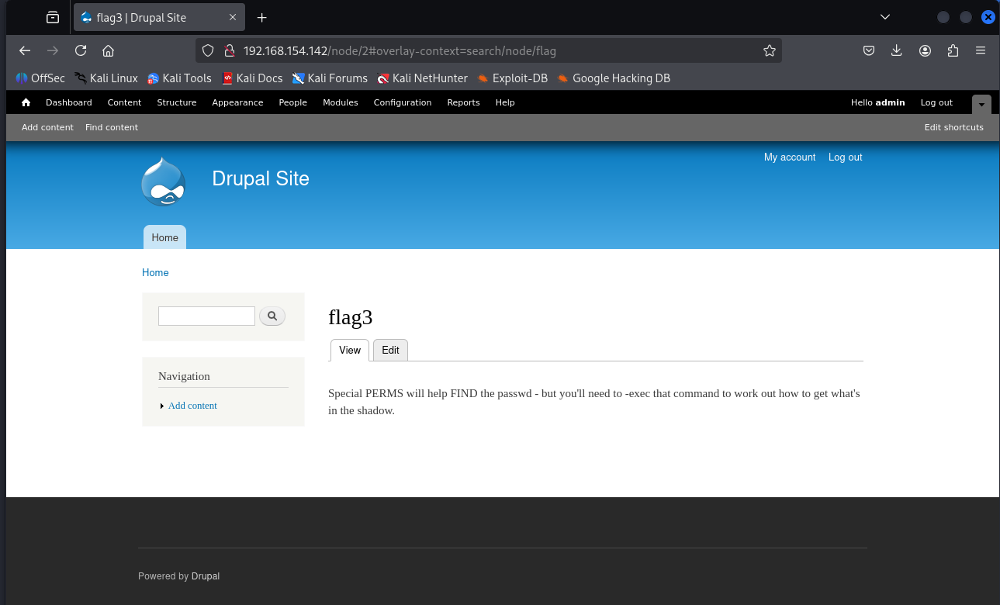

提示内容是：特殊的权限有助于发现密码，但是你需要去执行一些命令来发现隐藏的内容
我们尝试读取/etc/passwd 文件。但是没有权限读取/etc/shadow。不过我们发现这里有个 flag4

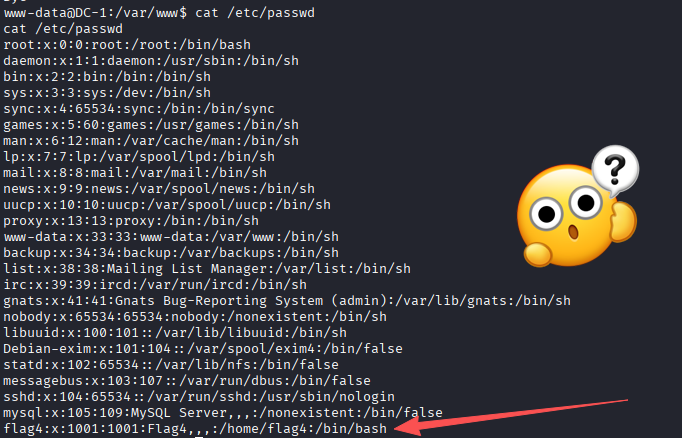

读取一下看看

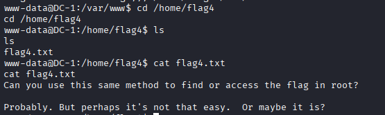

提示内容为：Can you use this same method to find or access the flag in root? Probably. But perhaps it's not that easy.  Or maybe it is? 你能用同样的方法在根目录中找到或访问该标志吗？也许可以。但或许没那么容易。又或许真的可以？

需要到/root 目录，但是提示权限不够，看来需要提到 root 权限。先搜索具备 SUID 权限的文件

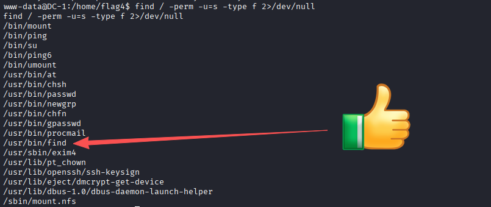

看见有 find ，我们直接 find 提权，然后到 root 里找到最后一个flag

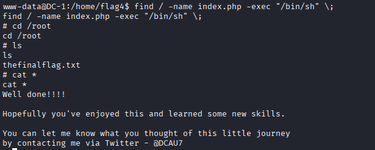